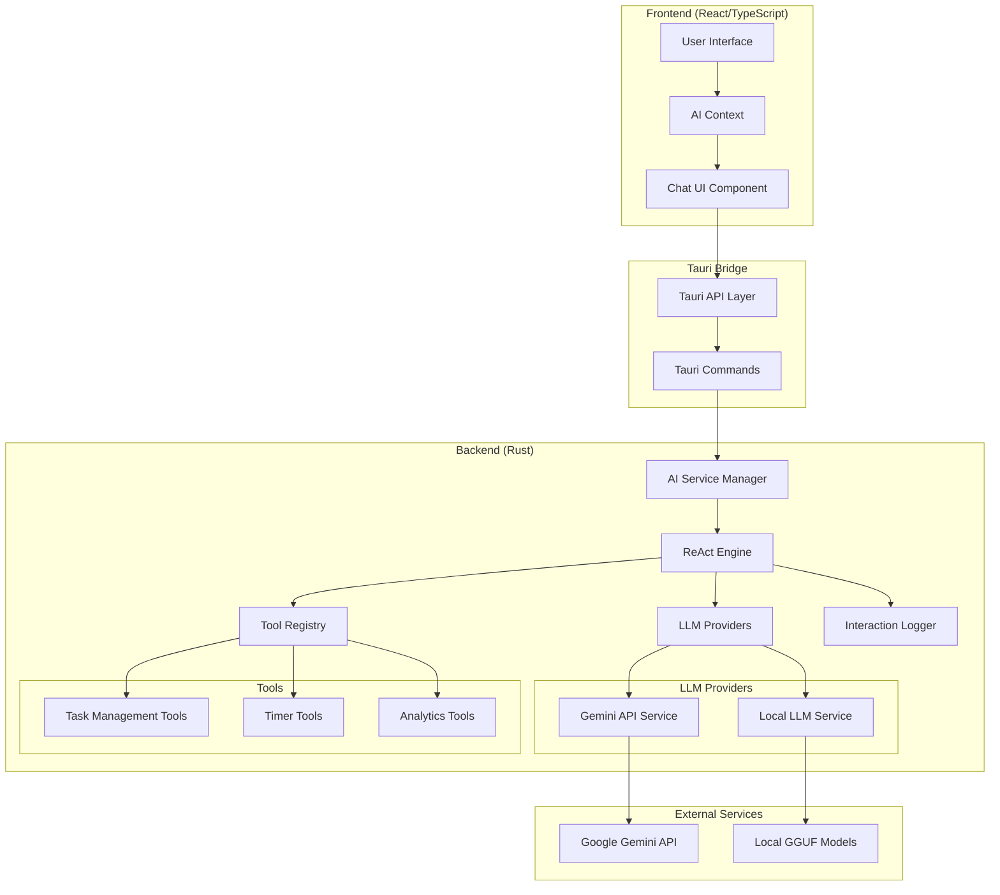
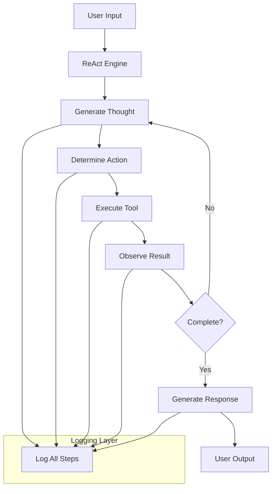

# Design Document

## Overview

This design outlines a comprehensive refactoring of KiraPilot's AI architecture to move all LLM processing from the frontend React application to the Rust backend, implement a ReAct (Reasoning and Acting) flow, and redesign tools for minimal user-friendly interactions. The refactor aims to improve performance, security, maintainability, and user experience while providing detailed logging of all AI interactions.

## Architecture

### High-Level Architecture



### ReAct Flow Architecture



## Components and Interfaces

### 1. Frontend AI Service Interface

**Purpose**: Lightweight frontend interface that delegates all AI processing to the backend.

**Key Components**:

- `BackendAIService`: New service that replaces current AI services
- `AIContext`: Updated to use backend service
- `ChatUI`: Enhanced with better loading states and error handling

**Interface**:

```typescript
interface BackendAIService {
  processMessage(message: string, context: AppContext): Promise<AIResponse>;
  getModelStatus(): Promise<ModelStatus>;
  switchModel(modelType: 'local' | 'gemini'): Promise<void>;
  clearConversation(): Promise<void>;
  getInteractionLogs(limit?: number): Promise<InteractionLog[]>;
}
```

### 2. Tauri Command Layer

**Purpose**: Bridge between frontend and backend AI services.

**Commands**:

```rust
#[tauri::command]
async fn process_ai_message(message: String, context: AppContext) -> Result<AIResponse, String>;

#[tauri::command]
async fn get_ai_model_status() -> Result<ModelStatus, String>;

#[tauri::command]
async fn switch_ai_model(model_type: String) -> Result<(), String>;

#[tauri::command]
async fn clear_ai_conversation() -> Result<(), String>;

#[tauri::command]
async fn get_ai_interaction_logs(limit: Option<u32>) -> Result<Vec<InteractionLog>, String>;
```

### 3. Backend AI Service Manager

**Purpose**: Central coordinator for all AI operations in the backend.

**Key Components**:

- Model management and switching
- Request routing to appropriate LLM provider
- Session management
- Error handling and recovery

**Structure**:

```rust
pub struct AIServiceManager {
    current_provider: Arc<Mutex<Box<dyn LLMProvider>>>,
    react_engine: ReActEngine,
    tool_registry: ToolRegistry,
    interaction_logger: InteractionLogger,
    conversation_history: ConversationHistory,
}
```

### 4. ReAct Engine

**Purpose**: Implements the Reasoning and Acting pattern for systematic problem-solving.

**Core Loop**:

1. **Thought**: Analyze the user request and current context
2. **Action**: Decide what tool to use or response to generate
3. **Observation**: Process tool results and evaluate progress
4. **Iteration**: Continue until task is complete or max iterations reached

**Structure**:

```rust
pub struct ReActEngine {
    max_iterations: u32,
    thought_prompt_template: String,
    action_prompt_template: String,
    observation_prompt_template: String,
}

pub struct ReActStep {
    step_type: ReActStepType,
    content: String,
    tool_call: Option<ToolCall>,
    tool_result: Option<ToolResult>,
    timestamp: DateTime<Utc>,
}

pub enum ReActStepType {
    Thought,
    Action,
    Observation,
    FinalAnswer,
}
```

### 5. LLM Provider Abstraction

**Purpose**: Unified interface for different LLM providers (local and cloud).

**Trait Definition**:

```rust
#[async_trait]
pub trait LLMProvider: Send + Sync {
    async fn generate(&self, prompt: &str, options: &GenerationOptions) -> Result<String, LLMError>;
    async fn is_ready(&self) -> bool;
    fn get_model_info(&self) -> ModelInfo;
    async fn initialize(&mut self) -> Result<(), LLMError>;
    async fn cleanup(&mut self) -> Result<(), LLMError>;
}
```

### 6. Enhanced Tool System

**Purpose**: Redesigned tools that work seamlessly without requiring user input of technical details.

**Key Improvements**:

- Automatic context inference
- Smart parameter resolution
- User-friendly error messages
- Comprehensive logging

**Tool Interface**:

```rust
#[async_trait]
pub trait Tool: Send + Sync {
    fn name(&self) -> &str;
    fn description(&self) -> &str;
    fn parameters(&self) -> &ToolParameters;
    async fn execute(&self, args: ToolArgs, context: &AppContext) -> Result<ToolResult, ToolError>;
    fn requires_confirmation(&self) -> bool { false }
    fn permission_level(&self) -> PermissionLevel { PermissionLevel::Safe }
}
```

### 7. Interaction Logger

**Purpose**: Comprehensive logging of all AI interactions for debugging and analysis.

**Logged Data**:

- Complete prompts sent to LLMs
- Raw responses from LLMs
- Tool executions with parameters and results
- ReAct reasoning steps
- Performance metrics
- Error details and stack traces

**Structure**:

```rust
pub struct InteractionLogger {
    storage: Box<dyn LogStorage>,
    config: LoggingConfig,
}

pub struct InteractionLog {
    id: String,
    session_id: String,
    timestamp: DateTime<Utc>,
    user_message: String,
    react_steps: Vec<ReActStep>,
    tool_executions: Vec<ToolExecution>,
    final_response: String,
    performance_metrics: PerformanceMetrics,
    model_info: ModelInfo,
}
```

## Data Models

### Core Data Structures

```rust
// AI Request/Response Models
#[derive(Debug, Clone, Serialize, Deserialize)]
pub struct AIRequest {
    pub message: String,
    pub context: AppContext,
    pub session_id: String,
    pub model_preference: Option<String>,
}

#[derive(Debug, Clone, Serialize, Deserialize)]
pub struct AIResponse {
    pub message: String,
    pub actions: Vec<AIAction>,
    pub suggestions: Vec<AISuggestion>,
    pub context: AppContext,
    pub reasoning: String,
    pub react_steps: Vec<ReActStep>,
}

// Tool System Models
#[derive(Debug, Clone, Serialize, Deserialize)]
pub struct ToolCall {
    pub name: String,
    pub args: HashMap<String, serde_json::Value>,
    pub id: String,
}

#[derive(Debug, Clone, Serialize, Deserialize)]
pub struct ToolResult {
    pub success: bool,
    pub data: serde_json::Value,
    pub message: String,
    pub execution_time_ms: u64,
}

// Logging Models
#[derive(Debug, Clone, Serialize, Deserialize)]
pub struct PerformanceMetrics {
    pub total_time_ms: u64,
    pub llm_time_ms: u64,
    pub tool_time_ms: u64,
    pub token_count: Option<u32>,
    pub iterations: u32,
}
```

### Database Schema Updates

```sql
-- AI Interaction Logs
CREATE TABLE ai_interaction_logs (
    id TEXT PRIMARY KEY,
    session_id TEXT NOT NULL,
    timestamp DATETIME NOT NULL,
    user_message TEXT NOT NULL,
    react_steps TEXT NOT NULL, -- JSON array
    tool_executions TEXT NOT NULL, -- JSON array
    final_response TEXT NOT NULL,
    performance_metrics TEXT NOT NULL, -- JSON object
    model_info TEXT NOT NULL, -- JSON object
    created_at DATETIME DEFAULT CURRENT_TIMESTAMP
);

-- AI Sessions
CREATE TABLE ai_sessions (
    id TEXT PRIMARY KEY,
    started_at DATETIME NOT NULL,
    ended_at DATETIME,
    model_type TEXT NOT NULL,
    interaction_count INTEGER DEFAULT 0,
    total_tokens INTEGER DEFAULT 0,
    created_at DATETIME DEFAULT CURRENT_TIMESTAMP
);

-- Tool Execution Logs
CREATE TABLE tool_execution_logs (
    id TEXT PRIMARY KEY,
    interaction_log_id TEXT NOT NULL,
    tool_name TEXT NOT NULL,
    args TEXT NOT NULL, -- JSON object
    result TEXT NOT NULL, -- JSON object
    execution_time_ms INTEGER NOT NULL,
    success BOOLEAN NOT NULL,
    timestamp DATETIME NOT NULL,
    FOREIGN KEY (interaction_log_id) REFERENCES ai_interaction_logs(id)
);
```

## Error Handling

### Error Types and Recovery Strategies

```rust
#[derive(Debug, thiserror::Error)]
pub enum AIServiceError {
    #[error("LLM provider error: {0}")]
    LLMError(#[from] LLMError),

    #[error("Tool execution error: {0}")]
    ToolError(#[from] ToolError),

    #[error("ReAct engine error: {0}")]
    ReActError(String),

    #[error("Configuration error: {0}")]
    ConfigError(String),

    #[error("Logging error: {0}")]
    LoggingError(String),
}

// Error Recovery Strategies
pub struct ErrorRecoveryManager {
    retry_config: RetryConfig,
    fallback_strategies: HashMap<String, Box<dyn FallbackStrategy>>,
}
```

### Graceful Degradation

1. **LLM Provider Failures**: Automatic fallback between local and cloud models
2. **Tool Execution Failures**: Retry with simplified parameters or alternative tools
3. **Logging Failures**: Continue operation with in-memory logging
4. **Network Issues**: Queue requests for retry when connection is restored

## Testing Strategy

### Unit Testing

1. **ReAct Engine Tests**:
   - Test reasoning loop with mock LLM responses
   - Verify tool selection logic
   - Test iteration limits and termination conditions

2. **Tool System Tests**:
   - Test parameter inference and validation
   - Mock database operations for isolated testing
   - Test error handling and recovery

3. **LLM Provider Tests**:
   - Mock API responses for Gemini provider
   - Test local model loading and generation
   - Test provider switching logic

### Integration Testing

1. **End-to-End AI Workflows**:
   - Complete user request processing
   - Multi-step tool execution scenarios
   - Cross-provider compatibility

2. **Performance Testing**:
   - Load testing with concurrent requests
   - Memory usage monitoring
   - Response time benchmarks

3. **Error Scenario Testing**:
   - Network failure simulation
   - Model unavailability scenarios
   - Tool execution failures

### Testing Infrastructure

```rust
// Test Utilities
pub struct MockLLMProvider {
    responses: VecDeque<String>,
    delay_ms: u64,
}

pub struct TestToolRegistry {
    tools: HashMap<String, Box<dyn Tool>>,
    execution_results: HashMap<String, ToolResult>,
}

pub struct InMemoryLogger {
    logs: Arc<Mutex<Vec<InteractionLog>>>,
}
```

## Performance Considerations

### Optimization Strategies

1. **Request Batching**: Group multiple tool executions when possible
2. **Caching**: Cache frequently used model responses and tool results
3. **Streaming**: Implement streaming responses for better perceived performance
4. **Resource Management**: Intelligent memory and CPU usage monitoring

### Monitoring and Metrics

```rust
pub struct PerformanceMonitor {
    metrics_collector: MetricsCollector,
    alert_thresholds: AlertThresholds,
}

pub struct Metrics {
    pub avg_response_time_ms: f64,
    pub requests_per_minute: f64,
    pub error_rate: f64,
    pub memory_usage_mb: f64,
    pub active_sessions: u32,
}
```

## Security Considerations

### API Key Management

1. **Secure Storage**: API keys stored in encrypted format
2. **Environment Variables**: Support for environment-based configuration
3. **Key Rotation**: Support for updating API keys without restart

### Data Privacy

1. **Local Processing**: All sensitive data processing happens locally
2. **Opt-in Logging**: Users can control what gets logged
3. **Data Retention**: Configurable log retention policies

### Input Validation

1. **Prompt Injection Protection**: Sanitize user inputs
2. **Parameter Validation**: Strict validation of tool parameters
3. **Rate Limiting**: Prevent abuse of AI services

## Migration Strategy

### Phase 1: Backend Infrastructure

- Implement ReAct engine and tool registry
- Create Tauri command layer
- Set up logging infrastructure

### Phase 2: LLM Provider Migration

- Move Gemini API calls to backend
- Enhance local LLM service
- Implement provider switching

### Phase 3: Frontend Updates

- Replace frontend AI services with backend calls
- Update UI components for new architecture
- Implement new error handling

### Phase 4: Tool System Enhancement

- Redesign tools for minimal user input
- Implement smart parameter inference
- Add comprehensive logging

### Phase 5: Testing and Optimization

- Comprehensive testing of all components
- Performance optimization
- User acceptance testing
