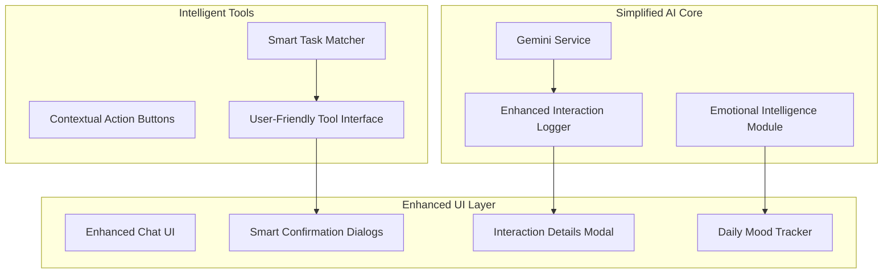

# Design Document

## Overview

This design refactors KiraPilot's AI experience to create a more human-like, engaging assistant focused on Gemini integration. The refactor simplifies the AI architecture by removing local model complexity, enhances interaction logging with detailed UI feedback, and introduces emotional intelligence features that make the AI feel more like a supportive companion.

## Architecture

### Current State Analysis

The existing AI system has:

- Complex multi-model support (Gemini + Local models)
- Technical tool interfaces requiring user knowledge of IDs
- Basic logging without detailed UI feedback
- Formal, technical communication style
- Limited user engagement features

### Target Architecture



## Components and Interfaces

### 1. Simplified AI Configuration

**GeminiOnlyAIService**

- Remove LocalAIService complexity
- Focus solely on Gemini API integration
- Simplified error handling and status management

```typescript
interface SimplifiedAIConfig {
  geminiApiKey: string;
  personalitySettings: {
    warmth: number; // 1-10 scale
    enthusiasm: number;
    supportiveness: number;
  };
  interactionStyle: 'casual' | 'professional' | 'friendly';
}
```

### 2. Enhanced Interaction Logging

**DetailedInteractionLogger**

- Capture complete conversation context
- Log tool selection reasoning
- Track user interaction patterns
- Store emotional context

```typescript
interface EnhancedInteractionLog {
  id: string;
  timestamp: Date;
  userMessage: string;
  aiResponse: string;
  toolsUsed: ToolExecution[];
  reasoning: string;
  emotionalContext: EmotionalContext;
  userFeedback?: UserFeedback;
}

interface ToolExecution {
  toolName: string;
  parameters: Record<string, unknown>;
  reasoning: string;
  result: unknown;
  executionTime: number;
  userConfirmed: boolean;
}
```

### 3. Smart Task Matching System

**IntelligentTaskMatcher**

- Natural language task identification
- Fuzzy matching for task titles
- Context-aware task suggestions

```typescript
interface TaskMatchResult {
  task: Task;
  confidence: number;
  matchReason: string;
  alternatives?: Task[];
}

interface TaskMatcher {
  findTaskByDescription(description: string): TaskMatchResult[];
  suggestTasksForContext(context: AppContext): Task[];
  resolveAmbiguousReference(query: string, candidates: Task[]): Task | null;
}
```

### 4. Emotional Intelligence Module

**EmotionalIntelligenceService**

- Daily mood tracking
- Stress level detection
- Supportive response generation
- Celebration and encouragement

```typescript
interface EmotionalContext {
  currentMood: MoodLevel;
  stressIndicators: StressIndicator[];
  recentAchievements: Achievement[];
  supportNeeds: SupportType[];
}

interface MoodLevel {
  energy: number; // 1-10
  focus: number;
  motivation: number;
  stress: number;
  timestamp: Date;
}
```

## Data Models

### Enhanced AI Settings

```typescript
interface EnhancedAISettings {
  // Simplified configuration
  geminiApiKey: string;

  // Personality configuration
  personality: {
    warmth: number;
    enthusiasm: number;
    supportiveness: number;
    humor: number;
  };

  // Interaction preferences
  interactionStyle: 'casual' | 'professional' | 'friendly';
  emojiUsage: 'minimal' | 'moderate' | 'frequent';
  celebrationStyle: 'subtle' | 'enthusiastic';

  // Logging preferences
  detailedLogging: boolean;
  logRetentionDays: number;

  // Emotional features
  dailyMoodTracking: boolean;
  stressDetection: boolean;
  encouragementFrequency: 'low' | 'medium' | 'high';
}
```

### Interaction Log Schema

```typescript
interface InteractionLogEntry {
  id: string;
  sessionId: string;
  timestamp: Date;

  // User input
  userMessage: string;
  userMood?: MoodLevel;
  contextData: AppContext;

  // AI processing
  reasoning: string;
  toolsConsidered: string[];
  toolsExecuted: ToolExecution[];

  // AI response
  response: string;
  emotionalTone: EmotionalTone;
  suggestions: AISuggestion[];

  // User feedback
  userRating?: number;
  userFeedback?: string;
  actionsTaken: UserAction[];
}
```

## Error Handling

### Graceful Degradation Strategy

1. **API Key Issues**
   - Clear setup instructions with visual guides
   - Test connection button with detailed feedback
   - Fallback to offline mode with limited features

2. **Network Connectivity**
   - Retry mechanism with exponential backoff
   - Offline mode indicator
   - Queue messages for when connection returns

3. **Tool Execution Failures**
   - User-friendly error messages
   - Suggested alternatives
   - Manual fallback options

### User-Friendly Error Messages

```typescript
interface ErrorMessage {
  title: string;
  description: string;
  actionable: boolean;
  suggestedActions: ErrorAction[];
  emotionalSupport?: string;
}

interface ErrorAction {
  label: string;
  action: () => void;
  primary: boolean;
}
```

## Testing Strategy

### Unit Testing

1. **Emotional Intelligence Module**
   - Mood detection accuracy
   - Appropriate response generation
   - Stress level calculation

2. **Task Matching System**
   - Fuzzy matching algorithms
   - Confidence scoring
   - Ambiguity resolution

3. **Interaction Logger**
   - Complete data capture
   - Performance impact measurement
   - Data privacy compliance

### Integration Testing

1. **End-to-End User Flows**
   - Daily mood check-in workflow
   - Task creation with natural language
   - Confirmation dialog interactions

2. **AI Response Quality**
   - Personality consistency
   - Emotional appropriateness
   - Helpfulness metrics

### User Experience Testing

1. **Emotional Engagement**
   - User satisfaction surveys
   - Engagement time metrics
   - Feature usage analytics

2. **Usability Testing**
   - Task completion rates
   - Error recovery success
   - Learning curve assessment

## Implementation Phases

### Phase 1: Core Simplification

- Remove local model infrastructure
- Implement Gemini-only service
- Create simplified settings UI

### Phase 2: Enhanced Logging

- Implement detailed interaction logging
- Create details modal UI
- Add logging preferences

### Phase 3: Smart Tools

- Implement task matching system
- Create confirmation dialogs
- Add contextual action buttons

### Phase 4: Emotional Intelligence

- Implement mood tracking
- Add daily check-ins
- Create supportive responses

### Phase 5: Polish & Optimization

- Performance optimization
- UI/UX refinements
- Comprehensive testing
