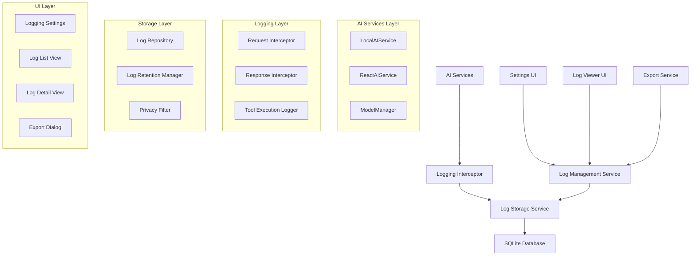

# Design Document

## Overview

The AI Interaction Logging feature will provide comprehensive logging capabilities for all AI interactions within KiraPilot. The system will capture detailed information about prompts, responses, tool executions, and metadata while giving users full control over data collection and privacy. The logging system will integrate seamlessly with the existing AI architecture and provide a user-friendly interface for viewing and managing logs.

## Architecture

### High-Level Architecture



### Component Integration

The logging system will integrate with the existing AI architecture by:

1. **Intercepting AI Service Calls**: Adding logging interceptors to `LocalAIService` and `ReactAIService`
2. **Extending ModelManager**: Adding logging coordination across different AI services
3. **Database Integration**: Using the existing SQLite database with new logging tables
4. **Settings Integration**: Adding logging controls to the existing Settings component
5. **Context Integration**: Extending AIContext to manage logging state

## Components and Interfaces

### Core Logging Components

#### 1. AIInteractionLogger

```typescript
interface AIInteractionLog {
  id: string;
  timestamp: Date;
  sessionId: string;
  modelType: 'local' | 'gemini';
  modelInfo: ModelInfo;

  // Request data
  userMessage: string;
  systemPrompt?: string;
  context: AppContext;

  // Response data
  aiResponse: string;
  actions: AIAction[];
  suggestions: AISuggestion[];
  reasoning?: string;

  // Tool execution data
  toolCalls: ToolExecutionLog[];

  // Performance metrics
  responseTime: number;
  tokenCount?: number;

  // Error information
  error?: string;
  errorCode?: string;

  // Privacy flags
  containsSensitiveData: boolean;
  dataClassification: 'public' | 'internal' | 'confidential';
}

interface ToolExecutionLog {
  toolName: string;
  arguments: Record<string, unknown>;
  result: ToolExecutionResult;
  executionTime: number;
  success: boolean;
  error?: string;
}

interface LoggingConfig {
  enabled: boolean;
  logLevel: 'minimal' | 'standard' | 'detailed';
  retentionDays: number;
  maxLogSize: number;
  includeSystemPrompts: boolean;
  includeToolExecutions: boolean;
  includePerformanceMetrics: boolean;
  autoCleanup: boolean;
  exportFormat: 'json' | 'csv';
}
```

#### 2. LogStorageService

```typescript
interface LogStorageService {
  // Core logging operations
  logInteraction(log: AIInteractionLog): Promise<void>;
  getInteractionLogs(filters: LogFilter): Promise<AIInteractionLog[]>;
  getInteractionLog(id: string): Promise<AIInteractionLog | null>;
  deleteInteractionLog(id: string): Promise<void>;

  // Bulk operations
  clearAllLogs(): Promise<void>;
  exportLogs(filters: LogFilter, format: 'json' | 'csv'): Promise<Blob>;

  // Maintenance operations
  cleanupOldLogs(): Promise<number>;
  getStorageStats(): Promise<LogStorageStats>;

  // Privacy operations
  anonymizeLogs(logIds: string[]): Promise<void>;
  redactSensitiveData(logId: string): Promise<void>;
}

interface LogFilter {
  startDate?: Date;
  endDate?: Date;
  modelType?: 'local' | 'gemini';
  hasErrors?: boolean;
  containsToolCalls?: boolean;
  searchText?: string;
  limit?: number;
  offset?: number;
}

interface LogStorageStats {
  totalLogs: number;
  totalSize: number;
  oldestLog?: Date;
  newestLog?: Date;
  logsByModel: Record<string, number>;
  averageResponseTime: number;
}
```

#### 3. LoggingInterceptor

```typescript
interface LoggingInterceptor {
  // Intercept AI service calls
  interceptRequest(
    service: AIServiceInterface,
    message: string,
    context: AppContext
  ): Promise<void>;

  interceptResponse(
    service: AIServiceInterface,
    response: AIResponse,
    metadata: ResponseMetadata
  ): Promise<void>;

  interceptError(
    service: AIServiceInterface,
    error: Error,
    context: RequestContext
  ): Promise<void>;

  // Tool execution logging
  logToolExecution(
    toolName: string,
    args: Record<string, unknown>,
    result: ToolExecutionResult,
    executionTime: number
  ): Promise<void>;
}

interface ResponseMetadata {
  responseTime: number;
  tokenCount?: number;
  modelInfo: ModelInfo;
  sessionId: string;
}

interface RequestContext {
  message: string;
  context: AppContext;
  sessionId: string;
  timestamp: Date;
}
```

### UI Components

#### 1. LoggingSettings Component

```typescript
interface LoggingSettingsProps {
  config: LoggingConfig;
  onConfigChange: (config: LoggingConfig) => void;
  storageStats: LogStorageStats;
  onClearLogs: () => Promise<void>;
  onExportLogs: (filters: LogFilter) => Promise<void>;
}
```

#### 2. LogViewer Component

```typescript
interface LogViewerProps {
  logs: AIInteractionLog[];
  loading: boolean;
  onLoadMore: () => void;
  onFilterChange: (filters: LogFilter) => void;
  onLogSelect: (log: AIInteractionLog) => void;
  onLogDelete: (logId: string) => void;
}
```

#### 3. LogDetailView Component

```typescript
interface LogDetailViewProps {
  log: AIInteractionLog;
  onClose: () => void;
  onDelete: () => void;
  onExport: () => void;
  onRedactSensitiveData: () => void;
}
```

## Data Models

### Database Schema

```sql
-- AI interaction logs table
CREATE TABLE ai_interaction_logs (
  id TEXT PRIMARY KEY,
  timestamp DATETIME NOT NULL,
  session_id TEXT NOT NULL,
  model_type TEXT NOT NULL,
  model_info TEXT NOT NULL, -- JSON

  -- Request data
  user_message TEXT NOT NULL,
  system_prompt TEXT,
  context TEXT NOT NULL, -- JSON

  -- Response data
  ai_response TEXT NOT NULL,
  actions TEXT, -- JSON array
  suggestions TEXT, -- JSON array
  reasoning TEXT,

  -- Performance metrics
  response_time INTEGER NOT NULL,
  token_count INTEGER,

  -- Error information
  error TEXT,
  error_code TEXT,

  -- Privacy flags
  contains_sensitive_data BOOLEAN DEFAULT FALSE,
  data_classification TEXT DEFAULT 'internal',

  -- Metadata
  created_at DATETIME DEFAULT CURRENT_TIMESTAMP,
  updated_at DATETIME DEFAULT CURRENT_TIMESTAMP
);

-- Tool execution logs table
CREATE TABLE tool_execution_logs (
  id TEXT PRIMARY KEY,
  interaction_log_id TEXT NOT NULL,
  tool_name TEXT NOT NULL,
  arguments TEXT NOT NULL, -- JSON
  result TEXT NOT NULL, -- JSON
  execution_time INTEGER NOT NULL,
  success BOOLEAN NOT NULL,
  error TEXT,

  created_at DATETIME DEFAULT CURRENT_TIMESTAMP,

  FOREIGN KEY (interaction_log_id) REFERENCES ai_interaction_logs(id) ON DELETE CASCADE
);

-- Logging configuration table
CREATE TABLE logging_config (
  id INTEGER PRIMARY KEY CHECK (id = 1), -- Singleton
  enabled BOOLEAN DEFAULT FALSE,
  log_level TEXT DEFAULT 'standard',
  retention_days INTEGER DEFAULT 30,
  max_log_size INTEGER DEFAULT 10485760, -- 10MB
  include_system_prompts BOOLEAN DEFAULT TRUE,
  include_tool_executions BOOLEAN DEFAULT TRUE,
  include_performance_metrics BOOLEAN DEFAULT TRUE,
  auto_cleanup BOOLEAN DEFAULT TRUE,
  export_format TEXT DEFAULT 'json',

  created_at DATETIME DEFAULT CURRENT_TIMESTAMP,
  updated_at DATETIME DEFAULT CURRENT_TIMESTAMP
);

-- Indexes for performance
CREATE INDEX idx_ai_logs_timestamp ON ai_interaction_logs(timestamp);
CREATE INDEX idx_ai_logs_model_type ON ai_interaction_logs(model_type);
CREATE INDEX idx_ai_logs_session_id ON ai_interaction_logs(session_id);
CREATE INDEX idx_tool_logs_interaction_id ON tool_execution_logs(interaction_log_id);
```

### Privacy and Data Classification

The system will implement data classification to handle sensitive information:

- **Public**: General AI interactions without personal data
- **Internal**: Interactions containing task names, project information
- **Confidential**: Interactions with personal information, API keys, or sensitive business data

## Error Handling

### Logging Failures

1. **Silent Degradation**: If logging fails, the AI interaction continues normally
2. **Error Recovery**: Implement retry mechanisms for transient failures
3. **Fallback Storage**: Use in-memory buffer if database is unavailable
4. **User Notification**: Inform users when logging is disabled due to errors

### Data Integrity

1. **Transaction Safety**: Use database transactions for log writes
2. **Validation**: Validate log data before storage
3. **Corruption Detection**: Implement checksums for critical log data
4. **Recovery Procedures**: Provide tools to recover from corrupted logs

## Testing Strategy

### Unit Tests

1. **LogStorageService**: Test CRUD operations, filtering, and export functionality
2. **LoggingInterceptor**: Test request/response interception and error handling
3. **Privacy Filter**: Test sensitive data detection and redaction
4. **Data Validation**: Test log data validation and sanitization

### Integration Tests

1. **AI Service Integration**: Test logging with LocalAIService and ReactAIService
2. **Database Operations**: Test log storage and retrieval with SQLite
3. **Settings Integration**: Test logging configuration changes
4. **Export Functionality**: Test log export in different formats

### Performance Tests

1. **High Volume Logging**: Test system performance with many concurrent logs
2. **Large Log Storage**: Test performance with large numbers of stored logs
3. **Query Performance**: Test log filtering and search performance
4. **Memory Usage**: Test memory consumption during logging operations

### Privacy Tests

1. **Data Redaction**: Test sensitive data detection and removal
2. **Access Controls**: Test that logs respect user privacy settings
3. **Data Retention**: Test automatic cleanup of old logs
4. **Export Privacy**: Test that exported data respects privacy settings

## Implementation Phases

### Phase 1: Core Logging Infrastructure

- Implement LogStorageService and database schema
- Create LoggingInterceptor for basic request/response logging
- Add logging configuration to user preferences

### Phase 2: AI Service Integration

- Integrate logging with LocalAIService and ReactAIService
- Implement tool execution logging
- Add performance metrics collection

### Phase 3: Settings UI

- Add logging settings to Settings component
- Implement log viewer interface
- Add basic export functionality

### Phase 4: Advanced Features

- Implement privacy filtering and data classification
- Add advanced search and filtering
- Implement automatic cleanup and retention policies

### Phase 5: Polish and Optimization

- Optimize database queries and indexing
- Add comprehensive error handling
- Implement advanced export formats and options
