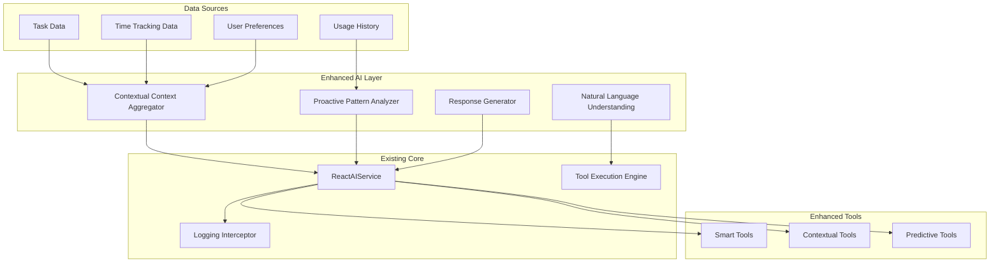

# Design Document

## Overview

The AI Interaction Optimization feature enhances KiraPilot's existing AI assistant to provide more natural, contextual, and useful interactions. Building on the current ReAct-based architecture with LangGraph, this optimization focuses on improving data flow, contextual awareness, and user experience while maintaining the privacy-first approach.

The design leverages the existing ReactAIService, tool execution system, and logging infrastructure to create a more intelligent and responsive AI assistant that adapts to user patterns and provides proactive assistance.

## Architecture

### Current System Analysis

The existing AI system consists of:

- **ReactAIService**: LangGraph-based ReAct pattern implementation with Google Gemini
- **Tool Execution Engine**: Permission-based tool execution with 15+ productivity tools
- **Logging System**: Comprehensive interaction logging with privacy controls
- **Context Management**: Basic app context including current task, timer state, and preferences

### Enhanced Architecture Components



## Components and Interfaces

### 1. Contextual Context Aggregator

**Purpose**: Intelligently gather and synthesize relevant context for AI interactions.

**Interface**:

```typescript
interface ContextualContextAggregator {
  buildEnhancedContext(
    baseContext: AppContext,
    userMessage: string,
    conversationHistory: AIConversation[]
  ): Promise<EnhancedAppContext>;

  analyzeContextRelevance(
    context: EnhancedAppContext,
    intent: UserIntent
  ): ContextRelevanceScore;
}

interface EnhancedAppContext extends AppContext {
  workflowState: WorkflowState;
  productivityMetrics: ProductivityMetrics;
  recentPatterns: UserPattern[];
  contextualInsights: ContextualInsight[];
  environmentalFactors: EnvironmentalFactors;
}
```

**Key Features**:

- Automatic context enrichment based on current activity
- Workflow state detection (planning, executing, reviewing)
- Recent activity pattern analysis
- Environmental context (time of day, day of week, workload)

### 2. Proactive Pattern Analyzer

**Purpose**: Analyze user behavior patterns to provide proactive suggestions and optimizations.

**Interface**:

```typescript
interface ProactivePatternAnalyzer {
  analyzeUserPatterns(
    timeframe: TimeFrame,
    focusAreas?: string[]
  ): Promise<PatternAnalysis>;

  generateProactiveSuggestions(
    context: EnhancedAppContext,
    patterns: PatternAnalysis
  ): Promise<ProactiveSuggestion[]>;

  detectWorkflowBottlenecks(patterns: PatternAnalysis): WorkflowBottleneck[];
}

interface ProactiveSuggestion extends AISuggestion {
  triggerCondition: TriggerCondition;
  automationPotential: number;
  impactScore: number;
  userAdoptionLikelihood: number;
}
```

**Key Features**:

- Real-time pattern detection
- Proactive suggestion generation
- Workflow bottleneck identification
- Automation opportunity detection

### 3. Natural Language Understanding Enhancement

**Purpose**: Improve the AI's understanding of user intent and context within conversations.

**Interface**:

```typescript
interface EnhancedNLU {
  extractUserIntent(
    message: string,
    context: EnhancedAppContext,
    conversationHistory: AIConversation[]
  ): Promise<IntentAnalysis>;

  identifyImplicitRequests(
    message: string,
    context: EnhancedAppContext
  ): Promise<ImplicitRequest[]>;

  detectEmotionalContext(
    message: string,
    recentInteractions: AIConversation[]
  ): EmotionalContext;
}

interface IntentAnalysis {
  primaryIntent: UserIntent;
  secondaryIntents: UserIntent[];
  confidence: number;
  contextualFactors: string[];
  suggestedActions: string[];
}
```

**Key Features**:

- Multi-intent detection
- Implicit request identification
- Emotional context awareness
- Contextual disambiguation

### 4. Enhanced Tool System

**Purpose**: Extend existing tools with contextual awareness and predictive capabilities.

**Enhanced Tool Categories**:

#### Smart Context Tools

- `analyze_current_workflow`: Understand current work state
- `suggest_next_actions`: Recommend next steps based on context
- `optimize_task_sequence`: Reorder tasks for better flow

#### Predictive Tools

- `predict_task_duration`: Estimate time based on historical data
- `suggest_break_timing`: Recommend optimal break times
- `detect_focus_patterns`: Identify peak productivity periods

#### Contextual Automation Tools

- `auto_schedule_tasks`: Smart task scheduling based on patterns
- `create_workflow_templates`: Generate reusable workflows
- `suggest_task_grouping`: Recommend task batching strategies

### 5. Response Generation Enhancement

**Purpose**: Generate more natural, contextual, and helpful responses.

**Interface**:

```typescript
interface EnhancedResponseGenerator {
  generateContextualResponse(
    toolResults: ToolExecutionResult[],
    context: EnhancedAppContext,
    userPersonality: UserPersonality
  ): Promise<EnhancedResponse>;

  adaptResponseStyle(
    baseResponse: string,
    userPreferences: ResponsePreferences,
    emotionalContext: EmotionalContext
  ): string;

  generateFollowUpSuggestions(
    context: EnhancedAppContext,
    completedAction: string
  ): Promise<FollowUpSuggestion[]>;
}

interface EnhancedResponse {
  message: string;
  reasoning: string;
  contextualInsights: string[];
  followUpSuggestions: FollowUpSuggestion[];
  proactiveRecommendations: ProactiveSuggestion[];
}
```

## Data Models

### Enhanced Context Models

```typescript
interface WorkflowState {
  currentPhase: 'planning' | 'executing' | 'reviewing' | 'break';
  focusLevel: number; // 1-10
  workloadIntensity: 'light' | 'moderate' | 'heavy' | 'overwhelming';
  timeInCurrentPhase: number; // minutes
  upcomingDeadlines: TaskDeadline[];
}

interface ProductivityMetrics {
  todayCompletionRate: number;
  averageTaskDuration: number;
  focusSessionEfficiency: number;
  breakPatternAdherence: number;
  energyLevel: number; // 1-10
}

interface UserPattern {
  type: 'productivity' | 'break' | 'task_switching' | 'focus';
  pattern: string;
  frequency: number;
  confidence: number;
  lastObserved: Date;
  trend: 'increasing' | 'stable' | 'decreasing';
}

interface ContextualInsight {
  type: 'optimization' | 'warning' | 'opportunity' | 'celebration';
  message: string;
  actionable: boolean;
  priority: Priority;
  relatedData: Record<string, unknown>;
}
```

### Enhanced Tool Models

```typescript
interface SmartToolExecution extends ToolExecutionResult {
  contextualRelevance: number;
  predictiveAccuracy?: number;
  userAdoptionRate?: number;
  automationPotential: number;
}

interface PredictiveInsight {
  prediction: string;
  confidence: number;
  basedOn: string[];
  timeframe: string;
  actionable: boolean;
  potentialImpact: 'low' | 'medium' | 'high';
}
```

## Error Handling

### Enhanced Error Recovery

1. **Context-Aware Error Messages**
   - Provide specific guidance based on current workflow state
   - Suggest alternative approaches when tools fail
   - Offer contextual help based on user patterns

2. **Graceful Degradation**
   - Fall back to basic functionality when enhanced features fail
   - Maintain core AI functionality even with context aggregation issues
   - Preserve user data and preferences during errors

3. **Proactive Error Prevention**
   - Detect potential issues before they occur
   - Warn users about conflicting actions
   - Suggest preventive measures based on patterns

### Error Handling Flow

```typescript
interface EnhancedErrorHandler {
  handleContextAggregationError(
    error: Error,
    fallbackContext: AppContext
  ): Promise<AppContext>;

  handlePatternAnalysisError(
    error: Error,
    basicSuggestions: AISuggestion[]
  ): Promise<AISuggestion[]>;

  generateContextualErrorMessage(
    error: Error,
    context: EnhancedAppContext
  ): string;
}
```

## Testing Strategy

### Unit Testing

1. **Context Aggregation Tests**
   - Test context enrichment accuracy
   - Validate relevance scoring algorithms
   - Test fallback mechanisms

2. **Pattern Analysis Tests**
   - Test pattern detection accuracy
   - Validate suggestion generation
   - Test performance with large datasets

3. **Enhanced Tool Tests**
   - Test contextual tool execution
   - Validate predictive accuracy
   - Test tool chaining and workflows

### Integration Testing

1. **End-to-End Workflow Tests**
   - Test complete user interaction flows
   - Validate context preservation across interactions
   - Test multi-tool execution scenarios

2. **Performance Tests**
   - Test response times with enhanced context
   - Validate memory usage with pattern analysis
   - Test concurrent user scenarios

3. **Privacy and Security Tests**
   - Validate data privacy in enhanced context
   - Test permission systems with new tools
   - Validate logging and audit trails

### User Experience Testing

1. **Natural Language Understanding Tests**
   - Test intent detection accuracy
   - Validate contextual disambiguation
   - Test emotional context recognition

2. **Response Quality Tests**
   - Test response naturalness and helpfulness
   - Validate contextual relevance
   - Test follow-up suggestion quality

3. **Proactive Feature Tests**
   - Test suggestion timing and relevance
   - Validate automation recommendations
   - Test user adoption of proactive features

## Performance Considerations

### Optimization Strategies

1. **Context Caching**
   - Cache frequently accessed context data
   - Implement intelligent cache invalidation
   - Use memory-efficient data structures

2. **Pattern Analysis Optimization**
   - Implement incremental pattern updates
   - Use efficient algorithms for large datasets
   - Cache pattern analysis results

3. **Response Generation Optimization**
   - Pre-generate common response templates
   - Implement streaming responses for long operations
   - Optimize tool execution ordering

### Monitoring and Metrics

1. **Performance Metrics**
   - Response time tracking
   - Context aggregation performance
   - Pattern analysis execution time

2. **Quality Metrics**
   - User satisfaction scores
   - Feature adoption rates
   - Error rates and recovery success

3. **Usage Metrics**
   - Feature utilization patterns
   - Tool execution frequency
   - Proactive suggestion acceptance rates

## Privacy and Security

### Data Privacy Enhancements

1. **Enhanced Local Processing**
   - All pattern analysis performed locally
   - Context aggregation without external data sharing
   - User control over data retention periods

2. **Granular Privacy Controls**
   - Fine-grained control over context sharing
   - Selective pattern analysis features
   - Opt-out mechanisms for all enhancements

3. **Data Minimization**
   - Only collect necessary context data
   - Automatic data cleanup and archival
   - User-controlled data export and deletion

### Security Considerations

1. **Enhanced Permission System**
   - Context-aware permission validation
   - Dynamic permission adjustment based on risk
   - Audit trails for all enhanced features

2. **Secure Context Handling**
   - Encrypted context storage
   - Secure inter-component communication
   - Protection against context injection attacks

## Migration and Compatibility

### Backward Compatibility

1. **Existing Feature Preservation**
   - All current AI features remain functional
   - Existing user preferences and settings preserved
   - Gradual enhancement rollout

2. **API Compatibility**
   - Existing tool interfaces remain unchanged
   - New features added as optional enhancements
   - Fallback to current behavior when needed

### Migration Strategy

1. **Phased Rollout**
   - Phase 1: Context aggregation enhancement
   - Phase 2: Pattern analysis and proactive features
   - Phase 3: Advanced predictive capabilities

2. **User Onboarding**
   - Progressive disclosure of new features
   - Contextual help and tutorials
   - Opt-in for advanced features

3. **Data Migration**
   - Automatic migration of existing interaction logs
   - Pattern analysis initialization from historical data
   - Preservation of user customizations
