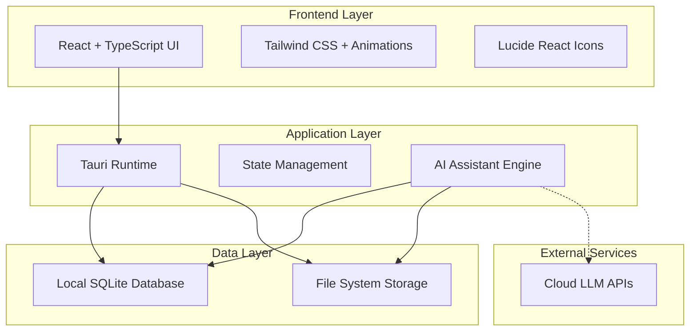

# Design Document

## Overview

KiraPilot is designed as a desktop productivity application built with Tauri, combining React frontend with Rust backend. The system emphasizes local-first data processing and storage, ensuring privacy and performance while providing a native desktop experience. The core innovation lies in the integration of Kira AI assistant, which has direct access to task management and time tracking features through a tool-based architecture.

## Architecture

### High-Level Architecture



### Platform-Specific Architecture

- **Desktop (macOS, Windows, Linux)**: Tauri + React frontend with Rust backend
- **Local Storage**: SQLite database with file system for all user data
- **AI Integration**: Optional cloud LLM APIs with local fallback processing

## Components and Interfaces

### Core Components

#### 1. Planning Interface Component

```typescript
interface PlanningProps {
  tasks: Task[];
  weeklyPlan: WeeklyPlan;
  suggestions: AISuggestion[];
}

interface WeeklyPlan {
  startDate: Date;
  endDate: Date;
  scheduledTasks: Task[];
  backlogTasks: Task[];
}
```

#### 2. Task Management System

```typescript
interface Task {
  id: string;
  title: string;
  description: RichTextContent;
  priority: Priority;
  status: TaskStatus;
  dependencies: string[];
  timeEstimate: number;
  actualTime: number;
  dueDate?: Date; // When the task is due (deadline)
  scheduledDate?: Date; // When the task is planned to be worked on
  tags: string[];
}

interface TaskManager {
  createTask(task: CreateTaskRequest): Promise<Task>;
  updateTask(id: string, updates: Partial<Task>): Promise<Task>;
  deleteTask(id: string): Promise<void>;
  getDependencies(taskId: string): Task[];
  validateDependencies(taskId: string): ValidationResult;
}
```

#### Planning System Logic

The planning interface uses `scheduledDate` for organizing tasks into columns:

- **Backlog Column**: Tasks with `scheduledDate = null` (no scheduled work date)
- **Day/Date Columns**: Tasks with `scheduledDate = specific date` (planned work date)
- **Upcoming Column**: Tasks with `scheduledDate` beyond current view period

Note: `dueDate` represents when a task must be completed (deadline), while `scheduledDate` represents when you plan to work on it. A task can have a due date but no scheduled date (appears in backlog until scheduled).

#### 3. Time Tracking Engine

```typescript
interface TimeTracker {
  startSession(taskId: string): Promise<TimerSession>;
  pauseSession(sessionId: string): Promise<void>;
  resumeSession(sessionId: string): Promise<void>;
  stopSession(sessionId: string, notes?: string): Promise<CompletedSession>;
  getCurrentSession(): TimerSession | null;
}

interface TimerSession {
  id: string;
  taskId: string;
  startTime: Date;
  pausedTime: number;
  isActive: boolean;
  notes: string;
}
```

#### 4. Kira AI Assistant

```typescript
interface KiraAI {
  processMessage(message: string, context: AppContext): Promise<AIResponse>;
  executeAction(action: AIAction): Promise<ActionResult>;
  generateSuggestions(context: AppContext): Promise<AISuggestion[]>;
  analyzePatterns(userId: string): Promise<PatternAnalysis>;
}

interface AIAction {
  type: 'CREATE_TASK' | 'START_TIMER' | 'UPDATE_TASK' | 'VIEW_TIME_DATA';
  parameters: Record<string, any>;
  context: AppContext;
}
```

### Data Models

#### Core Data Schema

```sql
-- Tasks table
CREATE TABLE tasks (
    id TEXT PRIMARY KEY,
    title TEXT NOT NULL,
    description TEXT,
    priority INTEGER DEFAULT 0,
    status TEXT DEFAULT 'pending',
    due_date DATETIME,
    created_at DATETIME DEFAULT CURRENT_TIMESTAMP,
    updated_at DATETIME DEFAULT CURRENT_TIMESTAMP
);

-- Task dependencies
CREATE TABLE task_dependencies (
    id TEXT PRIMARY KEY,
    task_id TEXT REFERENCES tasks(id),
    depends_on_id TEXT REFERENCES tasks(id),
    created_at DATETIME DEFAULT CURRENT_TIMESTAMP
);

-- Time tracking sessions
CREATE TABLE time_sessions (
    id TEXT PRIMARY KEY,
    task_id TEXT REFERENCES tasks(id),
    start_time DATETIME NOT NULL,
    end_time DATETIME,
    paused_duration INTEGER DEFAULT 0,
    notes TEXT,
    created_at DATETIME DEFAULT CURRENT_TIMESTAMP
);

-- AI interactions and suggestions
CREATE TABLE ai_interactions (
    id TEXT PRIMARY KEY,
    message TEXT NOT NULL,
    response TEXT NOT NULL,
    action_taken TEXT,
    created_at DATETIME DEFAULT CURRENT_TIMESTAMP
);
```

#### State Management Architecture

```typescript
interface AppState {
  tasks: TaskState;
  timer: TimerState;
  ai: AIState;
  ui: UIState;
}

interface TaskState {
  tasks: Task[];
  selectedTask: Task | null;
  filters: TaskFilters;
  loading: boolean;
  error: string | null;
}
```

## Error Handling

### Error Categories and Strategies

#### 1. Network Errors

- **Strategy**: Graceful degradation with local-first approach
- **Implementation**: Queue sync operations, retry with exponential backoff
- **User Experience**: Show offline indicator, continue local operations

#### 2. Data Validation Errors

- **Strategy**: Client-side validation with server-side verification
- **Implementation**: TypeScript interfaces with runtime validation using Zod
- **User Experience**: Inline validation messages, prevent invalid submissions

#### 3. AI Service Errors

- **Strategy**: Fallback to local processing or simplified responses
- **Implementation**: Circuit breaker pattern for external AI services
- **User Experience**: Inform user of limited AI functionality, maintain core features

#### 4. Database Errors

- **Strategy**: Transaction rollback and data integrity preservation
- **Implementation**: SQLite WAL mode with automatic backup
- **User Experience**: Show error message, attempt automatic recovery

### Error Handling Implementation

```typescript
class ErrorHandler {
  static handle(error: AppError): ErrorResponse {
    switch (error.type) {
      case 'NETWORK_ERROR':
        return this.handleNetworkError(error);
      case 'VALIDATION_ERROR':
        return this.handleValidationError(error);
      case 'AI_SERVICE_ERROR':
        return this.handleAIError(error);
      case 'DATABASE_ERROR':
        return this.handleDatabaseError(error);
      default:
        return this.handleUnknownError(error);
    }
  }
}
```

## Testing Strategy

### Testing Pyramid

#### 1. Unit Tests (70%)

- **Framework**: Jest + React Testing Library
- **Coverage**: Individual components, utilities, and business logic
- **Focus**: Pure functions, component behavior, data transformations

#### 2. Integration Tests (20%)

- **Framework**: Jest + Supertest for API testing
- **Coverage**: Component interactions, database operations, AI tool integration
- **Focus**: Data flow between layers, API endpoints, state management

#### 3. End-to-End Tests (10%)

- **Framework**: Playwright for cross-platform testing
- **Coverage**: Critical user journeys, AI assistant interactions
- **Focus**: Complete workflows, cross-device synchronization

### AI-Specific Testing

#### 1. AI Response Testing

```typescript
describe('Kira AI Assistant', () => {
  test('should create task from natural language', async () => {
    const response = await kira.processMessage(
      'Create a task to review the quarterly report by Friday',
      mockContext
    );

    expect(response.actions).toContainEqual({
      type: 'CREATE_TASK',
      parameters: {
        title: expect.stringContaining('quarterly report'),
        dueDate: expect.any(Date),
      },
    });
  });
});
```

#### 2. Time Tracking Testing

```typescript
describe('Time Tracking', () => {
  test('should track time sessions accurately', async () => {
    const session = await timeTracker.startSession('task123');
    await timeTracker.stopSession(session.id, 'Completed task');

    expect(session.taskId).toBe('task123');
    expect(session.endTime).toBeDefined();
  });
});
```

### Performance Testing

#### 1. Database Performance

- Test query performance with large datasets
- Validate indexing strategies
- Monitor memory usage during sync operations

#### 2. AI Response Times

- Benchmark local vs cloud AI processing
- Test fallback mechanisms
- Validate caching strategies

#### 3. Cross-Platform Performance

- Test startup times across platforms
- Validate memory usage on mobile devices
- Monitor battery impact on mobile platforms

### Security Testing

#### 1. Data Privacy

- Validate local data encryption
- Test data anonymization for cloud sync
- Verify no sensitive data in logs

#### 2. AI Security

- Test prompt injection resistance
- Validate tool access permissions
- Monitor for data leakage in AI responses

## Implementation Considerations

### Privacy-First Design

- All sensitive data processing and storage occurs locally
- No personal data shared with external services without explicit consent
- User has full control over AI interactions and data usage
- AI explanations are transparent and auditable

### Performance Optimization

- Lazy loading for large task lists
- Virtual scrolling for time tracking visualizations
- Debounced AI suggestions to prevent excessive API calls
- Efficient SQLite queries with proper indexing

### Accessibility

- Full keyboard navigation support
- Screen reader compatibility
- High contrast mode support
- Customizable font sizes and UI scaling

### Cross-Platform Consistency

- Native feel on macOS, Windows, and Linux
- Consistent design language across platforms
- Platform-specific optimizations and integrations
- Responsive design for different screen sizes
