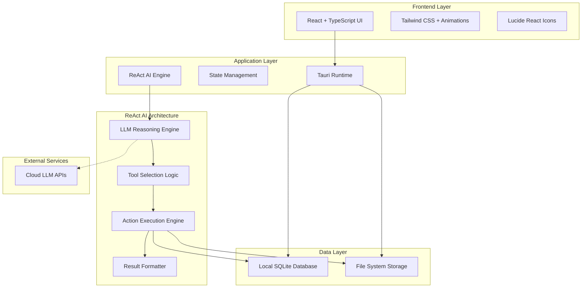
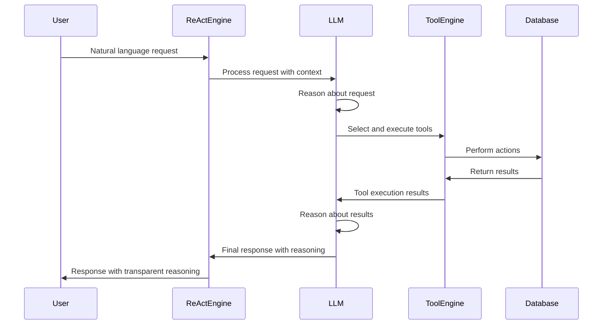
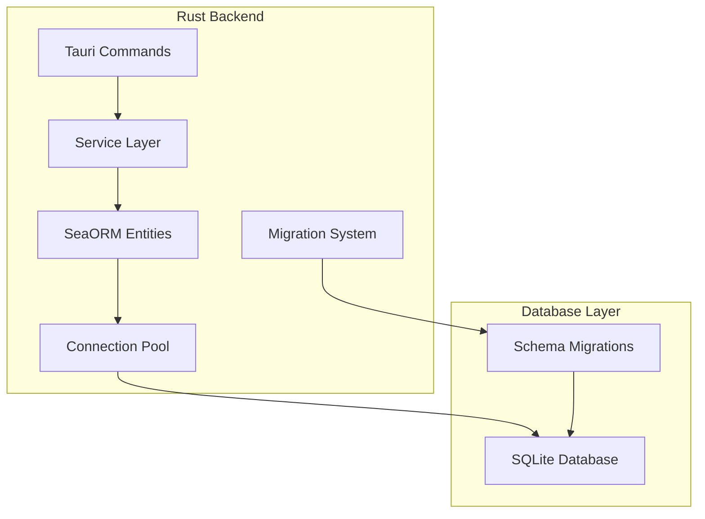

# Design Document

## Overview

KiraPilot is designed as a desktop productivity application built with Tauri, combining React frontend with Rust backend. The system emphasizes local-first data processing and storage, ensuring privacy and performance while providing a native desktop experience. The core innovation lies in the integration of Kira AI assistant, which has direct access to task management and time tracking features through a tool-based architecture.

## Architecture

### High-Level Architecture



### ReAct AI Architecture

The Kira AI assistant uses the ReAct (Reasoning and Acting) pattern, where the LLM dynamically reasons about user requests and chooses appropriate tools to execute actions. This approach eliminates rule-based decision making in favor of LLM-powered reasoning.

#### ReAct Workflow



#### Key ReAct Principles

1. **LLM-Driven Decision Making**: All tool selection and action sequencing is determined by the LLM's reasoning, not predefined rules
2. **Transparent Reasoning**: Users can see how Kira analyzed their request and chose specific actions
3. **Dynamic Tool Selection**: The LLM chooses from available tools based on context, not hardcoded logic
4. **Iterative Reasoning**: The LLM can reason through multi-step processes and adjust based on intermediate results

### Platform-Specific Architecture

- **Desktop (macOS, Windows, Linux)**: Tauri + React frontend with Rust backend
- **Local Storage**: SQLite database with SeaORM for type-safe database operations
- **AI Integration**: Optional cloud LLM APIs with local fallback processing

### SeaORM Integration Architecture



#### SeaORM Benefits

1. **Type Safety**: Compile-time guarantees for database operations
2. **Async Operations**: Non-blocking database queries for better performance
3. **Automatic Migrations**: Version-controlled schema changes
4. **Relationship Management**: Automatic handling of foreign keys and joins
5. **Query Builder**: Flexible, composable query construction
6. **Connection Pooling**: Efficient database connection management

## Components and Interfaces

### Core Components

#### 1. Planning Interface Component

```typescript
interface PlanningProps {
  tasks: Task[];
  weeklyPlan: WeeklyPlan;
  suggestions: AISuggestion[];
}

interface WeeklyPlan {
  startDate: Date;
  endDate: Date;
  scheduledTasks: Task[];
  backlogTasks: Task[];
}
```

#### 2. Task Management System

```typescript
interface Task {
  id: string;
  title: string;
  description: RichTextContent;
  priority: Priority;
  status: TaskStatus;
  dependencies: string[];
  timeEstimate: number;
  actualTime: number;
  dueDate?: Date; // When the task is due (deadline)
  scheduledDate?: Date; // When the task is planned to be worked on
  tags: string[];
}

interface TaskManager {
  createTask(task: CreateTaskRequest): Promise<Task>;
  updateTask(id: string, updates: Partial<Task>): Promise<Task>;
  deleteTask(id: string): Promise<void>;
  getDependencies(taskId: string): Task[];
  validateDependencies(taskId: string): ValidationResult;
}
```

#### SeaORM Repository Pattern

```rust
use sea_orm::*;

pub struct TaskRepository {
    db: DatabaseConnection,
}

impl TaskRepository {
    pub async fn create_task(&self, task_data: CreateTaskRequest) -> Result<task::Model, DbErr> {
        let task = task::ActiveModel {
            id: Set(Uuid::new_v4().to_string()),
            title: Set(task_data.title),
            description: Set(task_data.description),
            priority: Set(task_data.priority),
            status: Set("pending".to_string()),
            due_date: Set(task_data.due_date),
            scheduled_date: Set(task_data.scheduled_date),
            created_at: Set(Utc::now().naive_utc()),
            updated_at: Set(Utc::now().naive_utc()),
        };

        task.insert(&self.db).await
    }

    pub async fn find_with_dependencies(&self, task_id: &str) -> Result<(task::Model, Vec<task::Model>), DbErr> {
        let task = task::Entity::find_by_id(task_id)
            .one(&self.db)
            .await?
            .ok_or(DbErr::RecordNotFound("Task not found".to_string()))?;

        let dependencies = task
            .find_related(task_dependency::Entity)
            .find_also_related(task::Entity)
            .all(&self.db)
            .await?
            .into_iter()
            .filter_map(|(_, dep_task)| dep_task)
            .collect();

        Ok((task, dependencies))
    }

    pub async fn update_task(&self, id: &str, updates: UpdateTaskRequest) -> Result<task::Model, DbErr> {
        let task = task::Entity::find_by_id(id)
            .one(&self.db)
            .await?
            .ok_or(DbErr::RecordNotFound("Task not found".to_string()))?;

        let mut task: task::ActiveModel = task.into();

        if let Some(title) = updates.title {
            task.title = Set(title);
        }
        if let Some(description) = updates.description {
            task.description = Set(Some(description));
        }
        if let Some(priority) = updates.priority {
            task.priority = Set(priority);
        }
        if let Some(status) = updates.status {
            task.status = Set(status);
        }

        task.updated_at = Set(Utc::now().naive_utc());

        task.update(&self.db).await
    }
}
```

#### Planning System Logic

The planning interface uses `scheduledDate` for organizing tasks into columns:

- **Backlog Column**: Tasks with `scheduledDate = null` (no scheduled work date)
- **Day/Date Columns**: Tasks with `scheduledDate = specific date` (planned work date)
- **Upcoming Column**: Tasks with `scheduledDate` beyond current view period

Note: `dueDate` represents when a task must be completed (deadline), while `scheduledDate` represents when you plan to work on it. A task can have a due date but no scheduled date (appears in backlog until scheduled).

#### 3. Time Tracking Engine

```typescript
interface TimeTracker {
  startSession(taskId: string): Promise<TimerSession>;
  pauseSession(sessionId: string): Promise<void>;
  resumeSession(sessionId: string): Promise<void>;
  stopSession(sessionId: string, notes?: string): Promise<CompletedSession>;
  getCurrentSession(): TimerSession | null;
}

interface TimerSession {
  id: string;
  taskId: string;
  startTime: Date;
  pausedTime: number;
  isActive: boolean;
  notes: string;
}
```

#### 4. Kira AI Assistant (ReAct Architecture)

```typescript
interface KiraAI {
  processMessage(message: string, context: AppContext): Promise<AIResponse>;
  executeReActWorkflow(input: ReActInput): Promise<ReActResult>;
  generateSuggestions(context: AppContext): Promise<AISuggestion[]>;
  analyzePatterns(userId: string): Promise<PatternAnalysis>;
}

interface ReActInput {
  userMessage: string;
  conversationHistory: ConversationMessage[];
  availableTools: Tool[];
  context: AppContext;
}

interface ReActResult {
  reasoning: string[];
  toolExecutions: ToolExecution[];
  finalResponse: string;
  confidence: number;
}

interface ToolExecution {
  toolName: string;
  reasoning: string;
  parameters: Record<string, any>;
  result: ToolResult;
  executionTime: number;
}

interface AIAction {
  type: 'CREATE_TASK' | 'START_TIMER' | 'UPDATE_TASK' | 'VIEW_TIME_DATA';
  parameters: Record<string, any>;
  context: AppContext;
  reasoning: string; // LLM's reasoning for choosing this action
  confidence: number; // LLM's confidence in the action choice
}
```

### Data Models

#### SeaORM Entity Definitions

The application uses SeaORM for type-safe, async database operations with automatic migrations and relationship management.

```rust
// Task entity
#[derive(Clone, Debug, PartialEq, DeriveEntityModel)]
#[sea_orm(table_name = "tasks")]
pub struct Model {
    #[sea_orm(primary_key)]
    pub id: String,
    pub title: String,
    pub description: Option<String>,
    pub priority: i32,
    pub status: String,
    pub due_date: Option<DateTime>,
    pub scheduled_date: Option<DateTime>,
    pub created_at: DateTime,
    pub updated_at: DateTime,
}

#[derive(Copy, Clone, Debug, EnumIter, DeriveRelation)]
pub enum Relation {
    #[sea_orm(has_many = "super::task_dependency::Entity")]
    TaskDependencies,
    #[sea_orm(has_many = "super::time_session::Entity")]
    TimeSessions,
}

// Task dependency entity
#[derive(Clone, Debug, PartialEq, DeriveEntityModel)]
#[sea_orm(table_name = "task_dependencies")]
pub struct Model {
    #[sea_orm(primary_key)]
    pub id: String,
    pub task_id: String,
    pub depends_on_id: String,
    pub created_at: DateTime,
}

// Time session entity
#[derive(Clone, Debug, PartialEq, DeriveEntityModel)]
#[sea_orm(table_name = "time_sessions")]
pub struct Model {
    #[sea_orm(primary_key)]
    pub id: String,
    pub task_id: String,
    pub start_time: DateTime,
    pub end_time: Option<DateTime>,
    pub paused_duration: i32,
    pub notes: Option<String>,
    pub created_at: DateTime,
}

// AI interaction entity
#[derive(Clone, Debug, PartialEq, DeriveEntityModel)]
#[sea_orm(table_name = "ai_interactions")]
pub struct Model {
    #[sea_orm(primary_key)]
    pub id: String,
    pub message: String,
    pub response: String,
    pub action_taken: Option<String>,
    pub created_at: DateTime,
}
```

#### SeaORM Migration System

```rust
use sea_orm_migration::prelude::*;

#[derive(DeriveMigrationName)]
pub struct Migration;

#[async_trait::async_trait]
impl MigrationTrait for Migration {
    async fn up(&self, manager: &SchemaManager) -> Result<(), DbErr> {
        manager
            .create_table(
                Table::create()
                    .table(Tasks::Table)
                    .if_not_exists()
                    .col(ColumnDef::new(Tasks::Id).string().not_null().primary_key())
                    .col(ColumnDef::new(Tasks::Title).string().not_null())
                    .col(ColumnDef::new(Tasks::Description).text())
                    .col(ColumnDef::new(Tasks::Priority).integer().default(0))
                    .col(ColumnDef::new(Tasks::Status).string().default("pending"))
                    .col(ColumnDef::new(Tasks::DueDate).timestamp())
                    .col(ColumnDef::new(Tasks::ScheduledDate).timestamp())
                    .col(ColumnDef::new(Tasks::CreatedAt).timestamp().default(Expr::current_timestamp()))
                    .col(ColumnDef::new(Tasks::UpdatedAt).timestamp().default(Expr::current_timestamp()))
                    .to_owned(),
            )
            .await
    }

    async fn down(&self, manager: &SchemaManager) -> Result<(), DbErr> {
        manager
            .drop_table(Table::drop().table(Tasks::Table).to_owned())
            .await
    }
}
```

#### State Management Architecture

```typescript
interface AppState {
  tasks: TaskState;
  timer: TimerState;
  ai: AIState;
  ui: UIState;
}

interface TaskState {
  tasks: Task[];
  selectedTask: Task | null;
  filters: TaskFilters;
  loading: boolean;
  error: string | null;
}
```

## Error Handling

### Error Categories and Strategies

#### 1. Network Errors

- **Strategy**: Graceful degradation with local-first approach
- **Implementation**: Queue sync operations, retry with exponential backoff
- **User Experience**: Show offline indicator, continue local operations

#### 2. Data Validation Errors

- **Strategy**: Client-side validation with server-side verification
- **Implementation**: TypeScript interfaces with runtime validation using Zod
- **User Experience**: Inline validation messages, prevent invalid submissions

#### 3. AI Service Errors

- **Strategy**: Fallback to local processing or simplified responses
- **Implementation**: Circuit breaker pattern for external AI services
- **User Experience**: Inform user of limited AI functionality, maintain core features

#### 4. Database Errors

- **Strategy**: Transaction rollback and data integrity preservation
- **Implementation**: SQLite WAL mode with automatic backup
- **User Experience**: Show error message, attempt automatic recovery

### Error Handling Implementation

```typescript
class ErrorHandler {
  static handle(error: AppError): ErrorResponse {
    switch (error.type) {
      case 'NETWORK_ERROR':
        return this.handleNetworkError(error);
      case 'VALIDATION_ERROR':
        return this.handleValidationError(error);
      case 'AI_SERVICE_ERROR':
        return this.handleAIError(error);
      case 'DATABASE_ERROR':
        return this.handleDatabaseError(error);
      default:
        return this.handleUnknownError(error);
    }
  }
}
```

## Testing Strategy

### Testing Pyramid

#### 1. Unit Tests (70%)

- **Framework**: Jest + React Testing Library
- **Coverage**: Individual components, utilities, and business logic
- **Focus**: Pure functions, component behavior, data transformations

#### 2. Integration Tests (20%)

- **Framework**: Jest + Supertest for API testing
- **Coverage**: Component interactions, database operations, AI tool integration
- **Focus**: Data flow between layers, API endpoints, state management

#### 3. End-to-End Tests (10%)

- **Framework**: Playwright for cross-platform testing
- **Coverage**: Critical user journeys, AI assistant interactions
- **Focus**: Complete workflows, cross-device synchronization

### AI-Specific Testing

#### 1. AI Response Testing

```typescript
describe('Kira AI Assistant', () => {
  test('should create task from natural language', async () => {
    const response = await kira.processMessage(
      'Create a task to review the quarterly report by Friday',
      mockContext
    );

    expect(response.actions).toContainEqual({
      type: 'CREATE_TASK',
      parameters: {
        title: expect.stringContaining('quarterly report'),
        dueDate: expect.any(Date),
      },
    });
  });
});
```

#### 2. Time Tracking Testing

```typescript
describe('Time Tracking', () => {
  test('should track time sessions accurately', async () => {
    const session = await timeTracker.startSession('task123');
    await timeTracker.stopSession(session.id, 'Completed task');

    expect(session.taskId).toBe('task123');
    expect(session.endTime).toBeDefined();
  });
});
```

### Performance Testing

#### 1. Database Performance

- Test query performance with large datasets
- Validate indexing strategies
- Monitor memory usage during sync operations

#### 2. AI Response Times

- Benchmark local vs cloud AI processing
- Test fallback mechanisms
- Validate caching strategies

#### 3. Cross-Platform Performance

- Test startup times across platforms
- Validate memory usage on mobile devices
- Monitor battery impact on mobile platforms

### Security Testing

#### 1. Data Privacy

- Validate local data encryption
- Test data anonymization for cloud sync
- Verify no sensitive data in logs

#### 2. AI Security

- Test prompt injection resistance
- Validate tool access permissions
- Monitor for data leakage in AI responses

## Implementation Considerations

### Privacy-First Design

- All sensitive data processing and storage occurs locally
- No personal data shared with external services without explicit consent
- User has full control over AI interactions and data usage
- AI explanations are transparent and auditable

### Performance Optimization

- Lazy loading for large task lists
- Virtual scrolling for time tracking visualizations
- Debounced AI suggestions to prevent excessive API calls
- Efficient SQLite queries with proper indexing

### Accessibility

- Full keyboard navigation support
- Screen reader compatibility
- High contrast mode support
- Customizable font sizes and UI scaling

### Cross-Platform Consistency

- Native feel on macOS, Windows, and Linux
- Consistent design language across platforms
- Platform-specific optimizations and integrations
- Responsive design for different screen sizes
