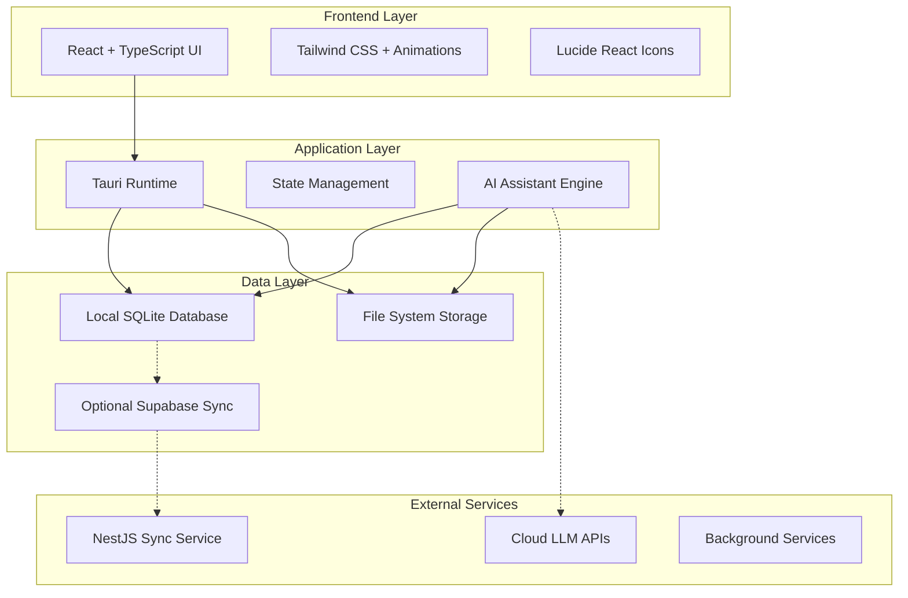

# Design Document

## Overview

KiraPilot is designed as a cross-platform productivity application with a hybrid architecture combining a Tauri-based desktop application and native mobile apps. The system emphasizes local-first data processing with optional cloud synchronization, ensuring privacy while providing seamless cross-device experiences. The core innovation lies in the integration of Kira AI assistant, which has direct access to all application features through a tool-based architecture.

## Architecture

### High-Level Architecture



### Platform-Specific Architecture

- **Desktop (macOS, Windows, Linux)**: Tauri + React frontend with Rust backend
- **Mobile (iOS, Android)**: React Native with shared TypeScript business logic
- **Shared Components**: TypeScript interfaces, data models, and AI logic

## Components and Interfaces

### Core Components

#### 1. Dashboard Component
```typescript
interface DashboardProps {
  tasks: Task[];
  energyMetrics: EnergyMetrics;
  weeklyPlan: WeeklyPlan;
  suggestions: AISuggestion[];
}

interface EnergyMetrics {
  currentLevel: number;
  focusScore: number;
  productivityTrend: TrendData[];
  optimalTimes: TimeSlot[];
}
```

#### 2. Task Management System
```typescript
interface Task {
  id: string;
  title: string;
  description: RichTextContent;
  priority: Priority;
  status: TaskStatus;
  dependencies: string[];
  timeEstimate: number;
  actualTime: number;
  dueDate?: Date;
  tags: string[];
}

interface TaskManager {
  createTask(task: CreateTaskRequest): Promise<Task>;
  updateTask(id: string, updates: Partial<Task>): Promise<Task>;
  deleteTask(id: string): Promise<void>;
  getDependencies(taskId: string): Task[];
  validateDependencies(taskId: string): ValidationResult;
}
```

#### 3. Time Tracking Engine
```typescript
interface TimeTracker {
  startSession(taskId: string): Promise<TimerSession>;
  pauseSession(sessionId: string): Promise<void>;
  resumeSession(sessionId: string): Promise<void>;
  stopSession(sessionId: string, notes?: string): Promise<CompletedSession>;
  getCurrentSession(): TimerSession | null;
}

interface TimerSession {
  id: string;
  taskId: string;
  startTime: Date;
  pausedTime: number;
  isActive: boolean;
  notes: string;
}
```

#### 4. Focus Environment Manager
```typescript
interface FocusManager {
  startFocusSession(config: FocusConfig): Promise<FocusSession>;
  endFocusSession(sessionId: string): Promise<FocusMetrics>;
  blockDistractions(): Promise<void>;
  restoreDistractions(): Promise<void>;
  updateWorkspace(context: TaskContext): Promise<void>;
}

interface FocusConfig {
  duration: number;
  taskId: string;
  distractionLevel: DistractionLevel;
  backgroundAudio?: AudioConfig;
  breakReminders: boolean;
}
```

#### 5. Kira AI Assistant
```typescript
interface KiraAI {
  processMessage(message: string, context: AppContext): Promise<AIResponse>;
  executeAction(action: AIAction): Promise<ActionResult>;
  generateSuggestions(context: AppContext): Promise<AISuggestion[]>;
  analyzePatterns(userId: string): Promise<PatternAnalysis>;
}

interface AIAction {
  type: 'CREATE_TASK' | 'START_TIMER' | 'SCHEDULE_FOCUS' | 'ANALYZE_PRODUCTIVITY';
  parameters: Record<string, any>;
  context: AppContext;
}
```

### Data Models

#### Core Data Schema

```sql
-- Tasks table
CREATE TABLE tasks (
    id TEXT PRIMARY KEY,
    title TEXT NOT NULL,
    description TEXT,
    priority INTEGER DEFAULT 0,
    status TEXT DEFAULT 'pending',
    due_date DATETIME,
    created_at DATETIME DEFAULT CURRENT_TIMESTAMP,
    updated_at DATETIME DEFAULT CURRENT_TIMESTAMP
);

-- Task dependencies
CREATE TABLE task_dependencies (
    id TEXT PRIMARY KEY,
    task_id TEXT REFERENCES tasks(id),
    depends_on_id TEXT REFERENCES tasks(id),
    created_at DATETIME DEFAULT CURRENT_TIMESTAMP
);

-- Time tracking sessions
CREATE TABLE time_sessions (
    id TEXT PRIMARY KEY,
    task_id TEXT REFERENCES tasks(id),
    start_time DATETIME NOT NULL,
    end_time DATETIME,
    paused_duration INTEGER DEFAULT 0,
    notes TEXT,
    created_at DATETIME DEFAULT CURRENT_TIMESTAMP
);

-- Focus sessions
CREATE TABLE focus_sessions (
    id TEXT PRIMARY KEY,
    task_id TEXT REFERENCES tasks(id),
    duration INTEGER NOT NULL,
    actual_duration INTEGER,
    focus_score REAL,
    distraction_count INTEGER DEFAULT 0,
    notes TEXT,
    created_at DATETIME DEFAULT CURRENT_TIMESTAMP
);

-- User patterns and analytics
CREATE TABLE productivity_patterns (
    id TEXT PRIMARY KEY,
    user_id TEXT NOT NULL,
    pattern_type TEXT NOT NULL,
    time_slot TEXT,
    productivity_score REAL,
    confidence_level REAL,
    created_at DATETIME DEFAULT CURRENT_TIMESTAMP
);
```

#### State Management Architecture

```typescript
interface AppState {
  user: UserState;
  tasks: TaskState;
  timer: TimerState;
  focus: FocusState;
  ai: AIState;
  sync: SyncState;
}

interface TaskState {
  tasks: Task[];
  selectedTask: Task | null;
  filters: TaskFilters;
  loading: boolean;
  error: string | null;
}
```

## Error Handling

### Error Categories and Strategies

#### 1. Network Errors
- **Strategy**: Graceful degradation with local-first approach
- **Implementation**: Queue sync operations, retry with exponential backoff
- **User Experience**: Show offline indicator, continue local operations

#### 2. Data Validation Errors
- **Strategy**: Client-side validation with server-side verification
- **Implementation**: TypeScript interfaces with runtime validation using Zod
- **User Experience**: Inline validation messages, prevent invalid submissions

#### 3. AI Service Errors
- **Strategy**: Fallback to local processing or simplified responses
- **Implementation**: Circuit breaker pattern for external AI services
- **User Experience**: Inform user of limited AI functionality, maintain core features

#### 4. Database Errors
- **Strategy**: Transaction rollback and data integrity preservation
- **Implementation**: SQLite WAL mode with automatic backup
- **User Experience**: Show error message, attempt automatic recovery

### Error Handling Implementation

```typescript
class ErrorHandler {
  static handle(error: AppError): ErrorResponse {
    switch (error.type) {
      case 'NETWORK_ERROR':
        return this.handleNetworkError(error);
      case 'VALIDATION_ERROR':
        return this.handleValidationError(error);
      case 'AI_SERVICE_ERROR':
        return this.handleAIError(error);
      case 'DATABASE_ERROR':
        return this.handleDatabaseError(error);
      default:
        return this.handleUnknownError(error);
    }
  }
}
```

## Testing Strategy

### Testing Pyramid

#### 1. Unit Tests (70%)
- **Framework**: Jest + React Testing Library
- **Coverage**: Individual components, utilities, and business logic
- **Focus**: Pure functions, component behavior, data transformations

#### 2. Integration Tests (20%)
- **Framework**: Jest + Supertest for API testing
- **Coverage**: Component interactions, database operations, AI tool integration
- **Focus**: Data flow between layers, API endpoints, state management

#### 3. End-to-End Tests (10%)
- **Framework**: Playwright for cross-platform testing
- **Coverage**: Critical user journeys, AI assistant interactions
- **Focus**: Complete workflows, cross-device synchronization

### AI-Specific Testing

#### 1. AI Response Testing
```typescript
describe('Kira AI Assistant', () => {
  test('should create task from natural language', async () => {
    const response = await kira.processMessage(
      "Create a task to review the quarterly report by Friday",
      mockContext
    );
    
    expect(response.actions).toContainEqual({
      type: 'CREATE_TASK',
      parameters: {
        title: expect.stringContaining('quarterly report'),
        dueDate: expect.any(Date)
      }
    });
  });
});
```

#### 2. Pattern Recognition Testing
```typescript
describe('Pattern Analysis', () => {
  test('should identify productivity patterns', async () => {
    const mockData = generateMockProductivityData();
    const patterns = await kira.analyzePatterns('user123');
    
    expect(patterns.optimalTimes).toBeDefined();
    expect(patterns.energyLevels).toHaveLength(7); // 7 days
  });
});
```

### Performance Testing

#### 1. Database Performance
- Test query performance with large datasets
- Validate indexing strategies
- Monitor memory usage during sync operations

#### 2. AI Response Times
- Benchmark local vs cloud AI processing
- Test fallback mechanisms
- Validate caching strategies

#### 3. Cross-Platform Performance
- Test startup times across platforms
- Validate memory usage on mobile devices
- Monitor battery impact on mobile platforms

### Security Testing

#### 1. Data Privacy
- Validate local data encryption
- Test data anonymization for cloud sync
- Verify no sensitive data in logs

#### 2. AI Security
- Test prompt injection resistance
- Validate tool access permissions
- Monitor for data leakage in AI responses

## Implementation Considerations

### Privacy-First Design
- All sensitive data processing occurs locally by default
- Cloud sync uses encrypted, anonymized data
- User has granular control over data sharing
- AI explanations are transparent and auditable

### Performance Optimization
- Lazy loading for large task lists
- Virtual scrolling for time tracking visualizations
- Debounced AI suggestions to prevent excessive API calls
- Efficient SQLite queries with proper indexing

### Accessibility
- Full keyboard navigation support
- Screen reader compatibility
- High contrast mode support
- Customizable font sizes and UI scaling

### Internationalization
- Support for multiple languages
- Locale-aware date and time formatting
- Cultural considerations for productivity patterns
- RTL language support