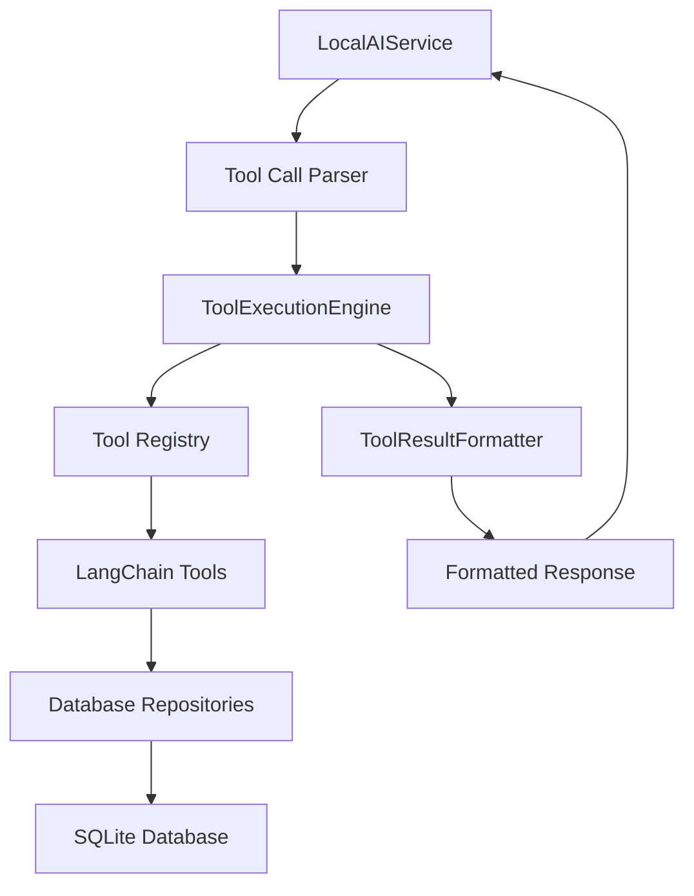

# Design Document

## Overview

The Local LLM tool execution system needs to be redesigned to properly integrate with the existing KiraPilot tool infrastructure. Currently, the `LocalAIService.executeTool()` method contains placeholder implementations instead of calling the actual tool functions from `tools.ts`. This design will establish a proper bridge between the Local LLM's tool call parsing and the existing LangChain-based tool system.

## Architecture

### Current State Analysis

The current system has these components:

- `LocalAIService`: Handles LLM communication and tool call parsing
- `tools.ts`: Contains actual tool implementations using LangChain's tool framework
- `ToolExecutionEngine`: Manages permissions and validation
- `ToolResultFormatter`: Formats tool results for display

The problem is that `LocalAIService.executeTool()` doesn't call the actual tools from `tools.ts`.

### Proposed Architecture



## Components and Interfaces

### 1. Tool Registry Service

Create a new `ToolRegistry` class that bridges LangChain tools with the Local LLM:

```typescript
interface ToolRegistry {
  registerTool(name: string, tool: Tool): void;
  executeTool(
    name: string,
    args: Record<string, unknown>
  ): Promise<ToolExecutionResult>;
  getAvailableTools(): string[];
  getToolSchema(name: string): ToolSchema | undefined;
}
```

### 2. Enhanced LocalAIService

Modify `LocalAIService` to use the tool registry:

```typescript
class LocalAIService {
  private toolRegistry: ToolRegistry;

  private async executeTool(
    toolName: string,
    args: Record<string, unknown>
  ): Promise<ToolExecutionResult> {
    return this.toolRegistry.executeTool(toolName, args);
  }
}
```

### 3. Tool Execution Bridge

Create a bridge that converts between LangChain tool format and our internal format:

```typescript
interface ToolExecutionBridge {
  convertLangChainResult(result: string): ToolExecutionResult;
  validateToolArgs(toolName: string, args: Record<string, unknown>): boolean;
  formatToolCall(toolName: string, args: Record<string, unknown>): string;
}
```

## Data Models

### Tool Execution Result Enhancement

Extend the existing `ToolExecutionResult` interface:

```typescript
interface ToolExecutionResult {
  success: boolean;
  data?: unknown;
  error?: string;
  userMessage: string;
  requiresConfirmation?: boolean;
  metadata?: {
    executionTime: number;
    toolName: string;
    permissions: PermissionLevel[];
    toolVersion?: string;
    dataModified?: boolean;
  };
}
```

### Tool Schema Definition

Define schemas for tool validation:

```typescript
interface ToolSchema {
  name: string;
  description: string;
  parameters: Record<string, ParameterSchema>;
  requiredPermissions: PermissionLevel[];
}

interface ParameterSchema {
  type: 'string' | 'number' | 'boolean' | 'object' | 'array';
  description: string;
  required: boolean;
  enum?: string[];
  format?: string;
}
```

## Error Handling

### Error Categories

1. **Tool Not Found**: When requested tool doesn't exist
2. **Permission Denied**: When user lacks required permissions
3. **Validation Error**: When tool arguments are invalid
4. **Execution Error**: When tool execution fails
5. **Database Error**: When database operations fail

### Error Recovery Strategy

```typescript
class ToolExecutionErrorHandler {
  async handleError(error: ToolExecutionError): Promise<ToolExecutionResult> {
    switch (error.type) {
      case 'TOOL_NOT_FOUND':
        return this.suggestAlternativeTools(error.toolName);
      case 'PERMISSION_DENIED':
        return this.requestPermissionElevation(error.requiredPermissions);
      case 'VALIDATION_ERROR':
        return this.provideValidationGuidance(error.validationErrors);
      case 'EXECUTION_ERROR':
        return this.retryWithFallback(error.originalRequest);
      default:
        return this.createGenericErrorResult(error);
    }
  }
}
```

## Testing Strategy

### Unit Tests

1. **Tool Registry Tests**
   - Tool registration and retrieval
   - Tool execution with valid/invalid arguments
   - Permission validation
   - Error handling for each error type

2. **LocalAIService Integration Tests**
   - Tool call parsing accuracy
   - End-to-end tool execution
   - Conversation history with tool results
   - Error recovery scenarios

3. **Tool Execution Bridge Tests**
   - LangChain result conversion
   - Argument validation
   - Format conversion accuracy

### Integration Tests

1. **Database Integration**
   - Actual task creation/modification
   - Timer session management
   - Data persistence verification

2. **Permission System Integration**
   - Permission enforcement
   - User preference handling
   - Confirmation flow testing

3. **Error Scenario Testing**
   - Network failures (for future cloud tools)
   - Database connection issues
   - Invalid tool arguments
   - Permission violations

### Performance Tests

1. **Tool Execution Performance**
   - Execution time benchmarks
   - Memory usage monitoring
   - Concurrent execution handling

2. **Parsing Performance**
   - Tool call parsing speed
   - Large response handling
   - Complex argument parsing

## Implementation Phases

### Phase 1: Core Infrastructure

- Create ToolRegistry class
- Implement tool registration system
- Create basic execution bridge

### Phase 2: LocalAIService Integration

- Modify LocalAIService to use ToolRegistry
- Update tool call parsing to use real tools
- Implement error handling

### Phase 3: Enhanced Features

- Add tool schema validation
- Implement advanced error recovery
- Add performance monitoring

### Phase 4: Testing and Validation

- Comprehensive unit test suite
- Integration test implementation
- Performance benchmarking

## Security Considerations

### Permission Validation

- All tool executions must validate permissions
- User preferences for auto-approval must be respected
- Sensitive operations require explicit confirmation

### Input Sanitization

- Tool arguments must be validated against schemas
- SQL injection prevention in database operations
- XSS prevention in formatted responses

### Audit Logging

- Log all tool executions for debugging
- Track permission violations
- Monitor performance metrics

## Migration Strategy

### Backward Compatibility

- Existing tool definitions in `tools.ts` remain unchanged
- Current ToolExecutionEngine interface preserved
- Gradual migration of LocalAIService methods

### Rollback Plan

- Feature flag for new tool execution system
- Ability to fall back to mock implementations
- Comprehensive error logging for debugging

## Success Metrics

### Functional Metrics

- 100% of existing tools work with Local LLM
- Tool execution success rate > 95%
- Error recovery success rate > 80%

### Performance Metrics

- Tool execution time < 500ms for simple operations
- Memory usage increase < 10MB
- No performance regression in existing functionality

### Quality Metrics

- Test coverage > 90% for new code
- Zero critical security vulnerabilities
- User satisfaction with tool execution feedback
