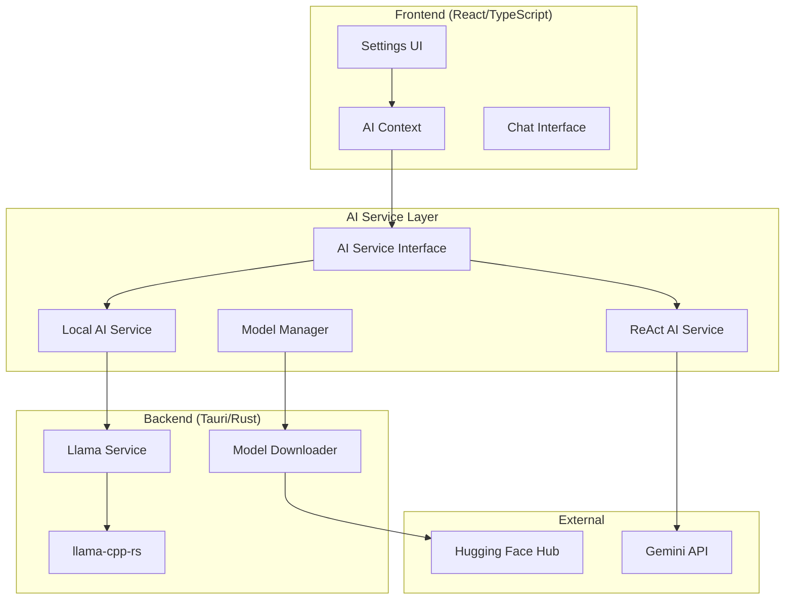

# Design Document

## Overview

This design document outlines the implementation of local AI model support for KiraPilot using llama-cpp-rs. The feature will integrate the unsloth/gemma-3-270m-it-GGUF model (gemma-3-270m-it-Q4_K_M.gguf) as a local alternative to the existing Gemini API, providing users with offline AI capabilities while maintaining privacy and data security.

The implementation follows KiraPilot's existing architecture patterns, extending the current AI service abstraction to support multiple model backends while preserving the existing ReAct (Reasoning + Acting) pattern and tool execution capabilities.

## Architecture

### High-Level Architecture



### Service Architecture

The design extends the existing AI service architecture with a new abstraction layer that supports multiple AI backends:

1. **AI Service Interface**: Abstract interface defining common AI operations
2. **Model Manager**: Handles model selection, initialization, and lifecycle
3. **Local AI Service**: Implements the AI interface using llama-cpp-rs
4. **Llama Service**: Tauri command layer for local model operations
5. **Model Downloader**: Handles automatic model downloading from Hugging Face

## Components and Interfaces

### 1. AI Service Interface

```typescript
interface AIServiceInterface {
  processMessage(message: string, context: AppContext): Promise<AIResponse>;
  isInitialized(): boolean;
  getModelInfo(): ModelInfo;
  setTranslationFunction(fn: TranslationFunction): void;
  clearConversation(): void;
}

interface ModelInfo {
  name: string;
  type: 'local' | 'cloud';
  status: 'ready' | 'loading' | 'downloading' | 'error';
  capabilities: string[];
}
```

### 2. Model Manager

```typescript
class ModelManager {
  private currentService: AIServiceInterface | null = null;
  private modelType: 'local' | 'gemini' = 'gemini';

  async switchModel(type: 'local' | 'gemini'): Promise<void>;
  getCurrentService(): AIServiceInterface | null;
  getModelStatus(): ModelStatus;
}

interface ModelStatus {
  type: 'local' | 'gemini';
  isReady: boolean;
  downloadProgress?: number;
  error?: string;
}
```

### 3. Local AI Service

```typescript
class LocalAIService implements AIServiceInterface {
  private isModelReady: boolean = false;
  private modelPath: string | null = null;

  async initialize(): Promise<void>;
  async processMessage(
    message: string,
    context: AppContext
  ): Promise<AIResponse>;
  async downloadModel(): Promise<void>;
  private formatPrompt(message: string, context: AppContext): string;
  private parseResponse(response: string): AIResponse;
}
```

### 4. Tauri Commands (Rust)

```rust
// Model management commands
#[tauri::command]
async fn initialize_local_model() -> Result<String, String>;

#[tauri::command]
async fn download_model(
    repo: String,
    model: String,
    progress_callback: String
) -> Result<String, String>;

#[tauri::command]
async fn generate_text(
    prompt: String,
    max_tokens: Option<i32>,
    temperature: Option<f32>
) -> Result<String, String>;

#[tauri::command]
async fn get_model_status() -> Result<ModelStatus, String>;

#[tauri::command]
async fn cleanup_model() -> Result<String, String>;
```

### 5. Llama Service (Rust)

```rust
pub struct LlamaService {
    backend: Option<LlamaBackend>,
    model: Option<LlamaModel>,
    context: Option<LlamaContext>,
    sampler: Option<LlamaSampler>,
}

impl LlamaService {
    pub async fn new() -> Result<Self, LlamaError>;
    pub async fn load_model(&mut self, model_path: PathBuf) -> Result<(), LlamaError>;
    pub async fn generate(&mut self, prompt: &str, options: GenerationOptions) -> Result<String, LlamaError>;
    pub fn is_ready(&self) -> bool;
    pub fn cleanup(&mut self);
}
```

## Data Models

### Model Configuration

```typescript
interface LocalModelConfig {
  modelName: string;
  modelRepo: string;
  modelFile: string;
  contextSize: number;
  maxTokens: number;
  temperature: number;
  threads: number;
  gpuLayers: number;
}

interface AISettings {
  modelType: 'local' | 'gemini';
  geminiApiKey?: string;
  localModelConfig: LocalModelConfig;
  conversationHistory: boolean;
  autoSuggestions: boolean;
  toolPermissions: boolean;
  responseStyle: 'concise' | 'balanced' | 'detailed';
  suggestionFrequency: 'minimal' | 'moderate' | 'frequent';
}
```

### Model Status

```rust
#[derive(Serialize, Deserialize, Debug, Clone)]
pub struct ModelStatus {
    pub is_available: bool,
    pub is_loaded: bool,
    pub model_path: Option<String>,
    pub download_progress: Option<f32>,
    pub error_message: Option<String>,
    pub model_info: Option<ModelInfo>,
}

#[derive(Serialize, Deserialize, Debug, Clone)]
pub struct ModelInfo {
    pub name: String,
    pub size_mb: u64,
    pub context_size: u32,
    pub parameter_count: String,
}
```

## Error Handling

### Error Types

```rust
#[derive(Debug, thiserror::Error)]
pub enum LlamaError {
    #[error("Model not found: {0}")]
    ModelNotFound(String),

    #[error("Download failed: {0}")]
    DownloadFailed(String),

    #[error("Model loading failed: {0}")]
    ModelLoadFailed(String),

    #[error("Generation failed: {0}")]
    GenerationFailed(String),

    #[error("Insufficient resources: {0}")]
    InsufficientResources(String),

    #[error("Configuration error: {0}")]
    ConfigurationError(String),
}
```

### Error Recovery

1. **Download Failures**: Retry with exponential backoff, fallback to Gemini
2. **Model Loading Failures**: Clear cache, re-download if necessary
3. **Generation Failures**: Retry with adjusted parameters, fallback to Gemini
4. **Resource Constraints**: Reduce context size, adjust thread count

## Testing Strategy

### Unit Tests

1. **Model Manager Tests**
   - Model switching functionality
   - Status tracking accuracy
   - Error handling scenarios

2. **Local AI Service Tests**
   - Message processing with mocked llama service
   - Prompt formatting validation
   - Response parsing accuracy

3. **Llama Service Tests**
   - Model loading and initialization
   - Text generation with various parameters
   - Resource management and cleanup

### Integration Tests

1. **End-to-End AI Workflow**
   - Complete message processing pipeline
   - Model switching during active conversations
   - Tool execution with local model

2. **Model Download and Setup**
   - Automatic model downloading
   - Progress tracking accuracy
   - Error recovery mechanisms

3. **Performance Tests**
   - Response time benchmarks
   - Memory usage monitoring
   - Concurrent request handling

### Mock Implementations

```typescript
class MockLocalAIService implements AIServiceInterface {
  async processMessage(
    message: string,
    context: AppContext
  ): Promise<AIResponse> {
    // Return predefined responses for testing
  }

  isInitialized(): boolean {
    return true;
  }

  // ... other mock implementations
}
```

## Implementation Details

### Model Integration

1. **Model Selection**: Default to gemma-3-270m-it-Q4_K_M.gguf for optimal balance of size and performance
2. **Context Management**: Use 2048 token context window for efficient memory usage
3. **Sampling Strategy**: Implement temperature-based sampling with configurable parameters
4. **Thread Management**: Auto-detect optimal thread count based on system capabilities

### Prompt Engineering

The local model will use a specialized prompt format optimized for the Gemma architecture:

```
<bos><start_of_turn>system
You are Kira, an AI assistant for KiraPilot productivity app. Help users with tasks, time tracking, and productivity.

Available tools: [tool_list]
Current context: [context_json]
<end_of_turn>
<start_of_turn>user
[user_message]
<end_of_turn>
<start_of_turn>model
```

### Tool Integration

The local model will integrate with the existing tool system by:

1. **Tool Detection**: Parse model output for tool calls using regex patterns
2. **Tool Execution**: Use existing ToolExecutionEngine for consistency
3. **Result Integration**: Format tool results back into conversation context
4. **Error Handling**: Graceful fallback when tool parsing fails

### Performance Optimization

1. **Model Caching**: Keep model loaded in memory during active use
2. **Context Reuse**: Maintain conversation context for efficiency
3. **Batch Processing**: Queue multiple requests when possible
4. **Resource Monitoring**: Track CPU/memory usage and adjust accordingly

### Security Considerations

1. **Model Verification**: Validate model checksums after download
2. **Sandboxing**: Run model inference in isolated context
3. **Resource Limits**: Enforce maximum memory and CPU usage
4. **Input Sanitization**: Validate and sanitize all user inputs

This design ensures seamless integration with KiraPilot's existing architecture while providing robust local AI capabilities that maintain the same user experience as the cloud-based Gemini integration.
