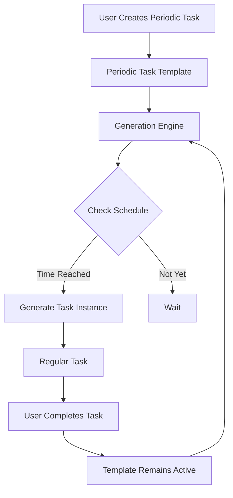

# Design Document

## Overview

The periodic tasks feature extends KiraPilot's task management system to support automatically recurring tasks. This system introduces a template-based approach where users create periodic task templates that generate new task instances based on configurable schedules. The design maintains separation between templates and generated instances while integrating seamlessly with existing task management features.

## Architecture

### Core Components

1. **Periodic Task Templates**: Master templates that define recurrence patterns and task properties
2. **Task Generation Engine**: Service responsible for creating new task instances from templates
3. **Recurrence Pattern System**: Flexible scheduling configuration supporting various intervals
4. **Template Management UI**: Interface for creating and managing periodic task templates
5. **Instance Tracking**: System to track relationships between templates and generated instances

### Data Flow



## Components and Interfaces

### Database Schema Extensions

#### New Table: periodic_task_templates

```sql
CREATE TABLE periodic_task_templates (
    id TEXT PRIMARY KEY,
    title TEXT NOT NULL,
    description TEXT,
    priority INTEGER NOT NULL DEFAULT 1,
    time_estimate INTEGER NOT NULL DEFAULT 0,
    tags TEXT, -- JSON array
    task_list_id TEXT,
    recurrence_type TEXT NOT NULL, -- 'daily', 'weekly', 'monthly', 'custom'
    recurrence_interval INTEGER NOT NULL DEFAULT 1, -- e.g., every 2 weeks
    recurrence_unit TEXT, -- 'days', 'weeks', 'months' for custom intervals
    start_date DATETIME NOT NULL,
    next_generation_date DATETIME NOT NULL,
    is_active BOOLEAN NOT NULL DEFAULT TRUE,
    created_at DATETIME NOT NULL,
    updated_at DATETIME NOT NULL,
    FOREIGN KEY (task_list_id) REFERENCES task_lists(id)
);
```

#### Modified Table: tasks

```sql
-- Add new columns to existing tasks table
ALTER TABLE tasks ADD COLUMN periodic_template_id TEXT;
ALTER TABLE tasks ADD COLUMN is_periodic_instance BOOLEAN DEFAULT FALSE;
ALTER TABLE tasks ADD COLUMN generation_date DATETIME;

-- Add foreign key constraint
ALTER TABLE tasks ADD CONSTRAINT fk_periodic_template
    FOREIGN KEY (periodic_template_id) REFERENCES periodic_task_templates(id);
```

### TypeScript Interfaces

```typescript
export enum RecurrenceType {
  DAILY = 'daily',
  WEEKLY = 'weekly',
  BIWEEKLY = 'biweekly',
  EVERY_THREE_WEEKS = 'every_three_weeks',
  MONTHLY = 'monthly',
  CUSTOM = 'custom',
}

export interface PeriodicTaskTemplate {
  id: string;
  title: string;
  description: string;
  priority: Priority;
  timeEstimate: number;
  tags: string[];
  taskListId: string;
  recurrenceType: RecurrenceType;
  recurrenceInterval: number; // For custom intervals
  recurrenceUnit?: 'days' | 'weeks' | 'months'; // For custom intervals
  startDate: Date;
  nextGenerationDate: Date;
  isActive: boolean;
  createdAt: Date;
  updatedAt: Date;
}

export interface CreatePeriodicTaskRequest {
  title: string;
  description?: string;
  priority?: Priority;
  timeEstimate?: number;
  tags?: string[];
  taskListId?: string;
  recurrenceType: RecurrenceType;
  recurrenceInterval?: number;
  recurrenceUnit?: 'days' | 'weeks' | 'months';
  startDate: Date;
}

export interface UpdatePeriodicTaskRequest {
  title?: string;
  description?: string;
  priority?: Priority;
  timeEstimate?: number;
  tags?: string[];
  taskListId?: string;
  recurrenceType?: RecurrenceType;
  recurrenceInterval?: number;
  recurrenceUnit?: 'days' | 'weeks' | 'months';
  isActive?: boolean;
}

// Extended Task interface
export interface Task {
  // ... existing properties
  periodicTemplateId?: string;
  isPeriodicInstance: boolean;
  generationDate?: Date;
}
```

### Service Layer

#### PeriodicTaskService

```typescript
export class PeriodicTaskService {
  // Template management
  async createTemplate(
    request: CreatePeriodicTaskRequest
  ): Promise<PeriodicTaskTemplate>;
  async updateTemplate(
    id: string,
    request: UpdatePeriodicTaskRequest
  ): Promise<PeriodicTaskTemplate>;
  async deleteTemplate(id: string): Promise<void>;
  async getTemplate(id: string): Promise<PeriodicTaskTemplate | null>;
  async getAllTemplates(): Promise<PeriodicTaskTemplate[]>;

  // Instance generation
  async generatePendingInstances(): Promise<Task[]>;
  async generateInstanceFromTemplate(templateId: string): Promise<Task>;
  async getInstancesForTemplate(templateId: string): Promise<Task[]>;

  // Recurrence calculation
  private calculateNextGenerationDate(template: PeriodicTaskTemplate): Date;
  private shouldGenerateInstance(template: PeriodicTaskTemplate): boolean;
}
```

#### TaskGenerationEngine

```typescript
export class TaskGenerationEngine {
  async checkAndGenerateInstances(): Promise<void>;
  async generateInstance(template: PeriodicTaskTemplate): Promise<Task>;
  private copyTemplateProperties(
    template: PeriodicTaskTemplate
  ): CreateTaskRequest;
  private updateNextGenerationDate(
    template: PeriodicTaskTemplate
  ): Promise<void>;
}
```

### UI Components

#### PeriodicTaskModal

- Form for creating/editing periodic task templates
- Recurrence pattern selector with visual preview
- Integration with existing task creation flow

#### PeriodicTaskList

- Display of all periodic task templates
- Status indicators (active/paused)
- Quick actions (edit, pause/resume, delete)

#### TaskCard Extensions

- Visual indicators for periodic instances
- Link to parent template
- Template relationship display

#### RecurrencePatternSelector

- Dropdown for common patterns (daily, weekly, etc.)
- Custom interval configuration
- Preview of next generation dates

## Data Models

### Recurrence Pattern Calculation

The system supports these recurrence patterns:

1. **Daily**: Every day from start date
2. **Weekly**: Every 7 days from start date
3. **Biweekly**: Every 14 days from start date
4. **Every 3 weeks**: Every 21 days from start date
5. **Monthly**: Same day each month (with month-end handling)
6. **Custom**: User-defined interval in days, weeks, or months

### Generation Logic

```typescript
function calculateNextGenerationDate(
  currentDate: Date,
  recurrenceType: RecurrenceType,
  interval: number = 1
): Date {
  const next = new Date(currentDate);

  switch (recurrenceType) {
    case RecurrenceType.DAILY:
      next.setDate(next.getDate() + interval);
      break;
    case RecurrenceType.WEEKLY:
      next.setDate(next.getDate() + 7 * interval);
      break;
    case RecurrenceType.BIWEEKLY:
      next.setDate(next.getDate() + 14);
      break;
    case RecurrenceType.EVERY_THREE_WEEKS:
      next.setDate(next.getDate() + 21);
      break;
    case RecurrenceType.MONTHLY:
      next.setMonth(next.getMonth() + interval);
      break;
  }

  return next;
}
```

## Error Handling

### Template Validation

- Ensure valid recurrence patterns
- Validate start dates (not in the past)
- Check for circular dependencies
- Validate task list existence

### Generation Failures

- Log failed generations with retry mechanism
- Handle database constraints gracefully
- Provide user notifications for critical failures
- Maintain template integrity on instance creation failure

### Data Integrity

- Cascade delete handling for templates and instances
- Orphaned instance cleanup
- Template-instance relationship validation

## Testing Strategy

### Unit Tests

- Recurrence pattern calculation accuracy
- Template CRUD operations
- Instance generation logic
- Date handling edge cases (leap years, month-end)

### Integration Tests

- End-to-end template creation and instance generation
- Database transaction integrity
- UI component interactions
- Service layer integration

### Performance Tests

- Bulk instance generation performance
- Database query optimization
- Memory usage with large numbers of templates

### Edge Case Tests

- Timezone handling
- Daylight saving time transitions
- Invalid date scenarios (Feb 29, month-end)
- System clock changes

## Migration Strategy

### Database Migration

1. Create periodic_task_templates table
2. Add new columns to tasks table
3. Create indexes for performance
4. Migrate any existing recurring patterns (if applicable)

### Backward Compatibility

- Existing tasks remain unaffected
- New columns have sensible defaults
- Gradual rollout of UI features
- Optional feature flag for early testing

### Data Migration

```sql
-- Migration script example
CREATE INDEX idx_periodic_templates_next_generation
    ON periodic_task_templates(next_generation_date, is_active);
CREATE INDEX idx_tasks_periodic_template
    ON tasks(periodic_template_id);
CREATE INDEX idx_tasks_is_periodic_instance
    ON tasks(is_periodic_instance);
```
