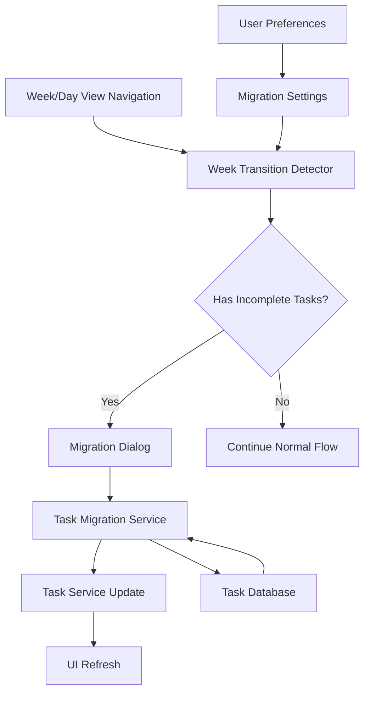

# Design Document

## Overview

The Task Week Migration feature provides a seamless user experience for managing incomplete tasks when transitioning between weeks in KiraPilot. The system will automatically detect when users navigate to a new week and present them with an intuitive interface to migrate incomplete tasks from the previous week.

This feature integrates with the existing Week View and Day View components, leveraging the current task management infrastructure while adding new migration-specific components and services.

## Architecture

### High-Level Architecture



### Component Integration

The migration feature will integrate with existing components:

- **WeekView.tsx**: Add migration trigger on week navigation
- **DayView.tsx**: Add migration trigger on day navigation to new week
- **TaskService.ts**: Extend with migration-specific queries
- **UserPreferences**: Add migration preferences storage

## Components and Interfaces

### 1. Week Transition Detection Service

**Purpose**: Detect when users navigate to a new week and determine if migration is needed.

```typescript
interface WeekTransitionDetector {
  detectWeekTransition(
    currentWeek: Date,
    previousWeek: Date,
    weekStartDay: 0 | 1
  ): boolean;
  shouldShowMigrationPrompt(
    currentWeek: Date,
    dismissedWeeks: Set<string>,
    migrationEnabled: boolean
  ): Promise<boolean>;
  getIncompleteTasksFromPreviousWeek(
    currentWeek: Date,
    weekStartDay: 0 | 1
  ): Promise<Task[]>;
}
```

**Key Methods**:

- `detectWeekTransition()`: Compare week boundaries using user's weekStartDay preference
- `shouldShowMigrationPrompt()`: Check if prompt should be shown based on preferences and dismissal history
- `getIncompleteTasksFromPreviousWeek()`: Query tasks with status PENDING or IN_PROGRESS from previous week

### 2. Task Migration Dialog Component

**Purpose**: Present migration options to users with clear task information and scheduling controls.

```typescript
interface TaskMigrationDialogProps {
  isOpen: boolean;
  onClose: () => void;
  incompleteTasks: Task[];
  currentWeek: Date;
  weekStartDay: 0 | 1;
  onMigrateTasks: (migrations: TaskMigration[]) => Promise<void>;
  onDismissWeek: () => void;
  onDisableMigration: () => void;
}

interface TaskMigration {
  taskId: string;
  newScheduledDate: Date;
}
```

**Features**:

- Task list with checkboxes for selection
- Task information display (title, priority, original scheduled date, task list)
- Day picker for current week
- Bulk actions (select all, clear all)
- Smart scheduling suggestions based on task estimates
- Dependency warnings for related tasks

### 3. Migration Preferences Service

**Purpose**: Manage user preferences for migration behavior.

```typescript
interface MigrationPreferences {
  enabled: boolean;
  dismissedWeeks: Set<string>; // Week identifiers that were dismissed
  autoSuggestScheduling: boolean;
  showDependencyWarnings: boolean;
}

interface MigrationPreferencesService {
  getPreferences(): Promise<MigrationPreferences>;
  updatePreferences(preferences: Partial<MigrationPreferences>): Promise<void>;
  addDismissedWeek(weekIdentifier: string): Promise<void>;
  clearDismissedWeeks(): Promise<void>;
}
```

### 4. Task Migration Service

**Purpose**: Handle the business logic for migrating tasks between weeks.

```typescript
interface TaskMigrationService {
  migrateTasksToWeek(migrations: TaskMigration[]): Promise<MigrationResult>;
  suggestSchedulingForTasks(
    tasks: Task[],
    targetWeek: Date
  ): TaskSchedulingSuggestion[];
  validateMigrations(migrations: TaskMigration[]): ValidationResult[];
}

interface MigrationResult {
  successful: TaskMigration[];
  failed: { migration: TaskMigration; error: string }[];
  summary: {
    totalMigrated: number;
    byDay: Record<string, number>;
  };
}

interface TaskSchedulingSuggestion {
  taskId: string;
  suggestedDate: Date;
  reason: 'priority' | 'time_estimate' | 'dependencies' | 'workload_balance';
  confidence: number;
}
```

## Data Models

### Extended Task Filters

Extend existing `TaskFilters` interface to support week-based queries:

```typescript
interface TaskFilters {
  // ... existing filters
  scheduledWeek?: {
    weekStart: Date;
    weekEnd: Date;
  };
  excludePeriodicInstances?: boolean; // For migration, exclude auto-generated instances
}
```

### Migration Session State

```typescript
interface MigrationSession {
  id: string;
  weekTransition: {
    from: Date;
    to: Date;
  };
  incompleteTasks: Task[];
  selectedTasks: Set<string>;
  schedulingChoices: Map<string, Date>;
  isDismissed: boolean;
  createdAt: Date;
}
```

### Week Identifier Format

Use consistent week identification across the system:

```typescript
function getWeekIdentifier(date: Date, weekStartDay: 0 | 1): string {
  const weekStart = getWeekStartDate(date, weekStartDay);
  return weekStart.toISOString().split('T')[0]; // YYYY-MM-DD format
}
```

## Error Handling

### Migration Error Types

```typescript
enum MigrationErrorType {
  TASK_NOT_FOUND = 'task_not_found',
  INVALID_DATE = 'invalid_date',
  DATABASE_ERROR = 'database_error',
  DEPENDENCY_CONFLICT = 'dependency_conflict',
  PERMISSION_DENIED = 'permission_denied',
}

interface MigrationError {
  type: MigrationErrorType;
  taskId?: string;
  message: string;
  recoverable: boolean;
}
```

### Error Recovery Strategies

1. **Partial Migration Success**: Allow successful migrations to proceed even if some fail
2. **Retry Mechanism**: Provide retry options for recoverable errors
3. **Rollback Support**: Ability to undo migrations if needed
4. **Graceful Degradation**: Continue normal operation if migration service fails

## Testing Strategy

### Unit Tests

1. **WeekTransitionDetector**
   - Week boundary calculations with different weekStartDay values
   - Incomplete task detection logic
   - Edge cases (month boundaries, year boundaries)

2. **TaskMigrationService**
   - Migration validation logic
   - Scheduling suggestion algorithms
   - Error handling scenarios

3. **MigrationPreferencesService**
   - Preference persistence and retrieval
   - Dismissed week tracking
   - Default value handling

### Integration Tests

1. **End-to-End Migration Flow**
   - Navigate to new week → prompt appears → migrate tasks → verify updates
   - Test with both Week View and Day View
   - Test dismissal and preference persistence

2. **Database Integration**
   - Task query performance with date filters
   - Concurrent migration handling
   - Data consistency during migrations

3. **UI Component Integration**
   - Modal behavior and accessibility
   - Task selection and scheduling UI
   - Error display and recovery flows

### Performance Tests

1. **Large Task Sets**: Test migration with 100+ incomplete tasks
2. **Concurrent Users**: Simulate multiple migration sessions
3. **Database Query Optimization**: Ensure efficient date-range queries

## Implementation Phases

### Phase 1: Core Infrastructure

- Week transition detection service
- Basic migration dialog component
- Task query extensions for date ranges
- Migration preferences storage

### Phase 2: Enhanced UX

- Smart scheduling suggestions
- Dependency conflict detection
- Bulk selection and actions
- Migration summary and feedback

### Phase 3: Advanced Features

- Manual migration triggers
- Migration history and analytics
- Performance optimizations
- Accessibility improvements

## Security Considerations

1. **Data Validation**: Validate all date inputs and task IDs
2. **Permission Checks**: Ensure users can only migrate their own tasks
3. **Rate Limiting**: Prevent excessive migration requests
4. **Data Integrity**: Maintain task relationships and constraints during migration

## Accessibility Requirements

1. **Keyboard Navigation**: Full keyboard support for migration dialog
2. **Screen Reader Support**: Proper ARIA labels and announcements
3. **High Contrast**: Ensure visibility in high contrast modes
4. **Focus Management**: Proper focus handling when dialog opens/closes
5. **Alternative Text**: Descriptive text for all interactive elements

## Localization Support

The migration feature will support all existing KiraPilot languages with new translation keys:

```typescript
// New translation keys needed
interface MigrationTranslations {
  'migration.dialog.title': string;
  'migration.dialog.description': string;
  'migration.task.originalDate': string;
  'migration.task.newDate': string;
  'migration.actions.migrateSelected': string;
  'migration.actions.skipWeek': string;
  'migration.actions.dontAskAgain': string;
  'migration.summary.success': string;
  'migration.errors.taskNotFound': string;
  // ... additional keys
}
```
