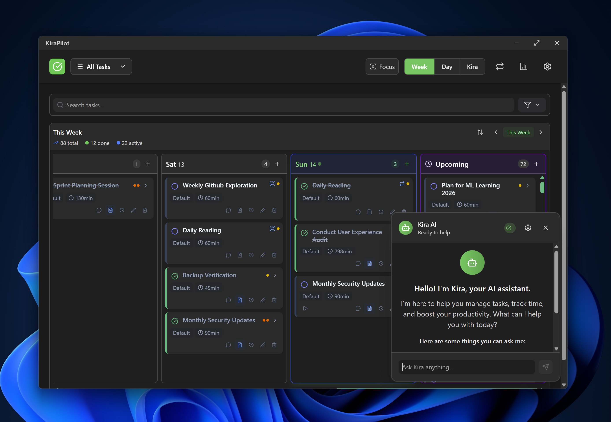

<p align="center">
  
  <h1 align="center">🚀 KiraPilot 🚀</h1>
  <p align="center">Navigate your day with precision, powered by intelligent AI assistance!</p>
</p>

**WIP Warning:** This is a work-in-progress. APIs and data will be changed a lot in the future.

<p align="center">
  <a href="https://github.com/vietanhdev/kirapilot-app/blob/main/LICENSE">
    
  </a>
  <a href="https://github.com/vietanhdev/kirapilot-app/issues">
    
  </a>
  <a href="https://github.com/vietanhdev/kirapilot-app/releases">
    
  </a>
  <a href="https://github.com/vietanhdev/kirapilot-app/stargazers">
    
  </a>
  <a href="https://twitter.com/vietanhdev">
    
  </a>
</p>

---

KiraPilot is a cross-platform productivity application that combines task management, time tracking, and intelligent AI assistance. The app helps users navigate their day with precision through beautiful design and smart automation.



## ✨ Core Features

- **Task Management**: Rich text descriptions, priority levels, dependencies, and week-based planning
- **Time Tracking**: Built-in timer with session notes and productivity analytics
- **Pattern Recognition**: Productivity analytics and automatic scheduling suggestions
- **AI Assistant**: Natural language interface powered by Google Gemini with tool access to all app features
- **Periodic Tasks**: Automated recurring task generation with flexible scheduling
- **Internationalization**: Multi-language support with comprehensive translation system

## 🚀 Technology Stack

- **Frontend**: React 19+ with TypeScript
- **Backend**: Tauri v2 (Rust)
- **Build Tool**: Vite 7+ with HMR
- **Database**: SQLite via Tauri SQL plugin
- **Styling**: Tailwind CSS 4+ with HeroUI components
- **Icons**: Lucide React
- **Animations**: Framer Motion
- **Rich Text**: Tiptap editor
- **Drag & Drop**: @dnd-kit
- **Validation**: Zod schemas
- **AI Framework**: LangChain with Google Gemini integration
- **ORM**: SeaORM for type-safe database operations

## 🛠️ Development

### Prerequisites

- Node.js (LTS version)
- Rust (latest stable)

### Getting Started

```bash
# Install dependencies
npm ci

# Start development server
npm run dev

# Start Tauri app in development mode
npm run tauri dev
```

### Code Quality

```bash
# Linting and formatting
npm run lint              # ESLint check
npm run lint:fix          # ESLint auto-fix
npm run format           # Prettier format
npm run type-check       # TypeScript check

# Testing
npm test                 # Run Jest tests
npm run test:watch       # Jest in watch mode
npm run test:coverage    # Generate coverage report

# Building
npm run build            # Build frontend
npm run tauri build      # Build Tauri application
```

## 🏗️ Project Structure

```
src/
├── components/           # React components by feature
│   ├── common/          # Shared UI components
│   ├── planning/        # Task planning and scheduling
│   ├── timer/           # Time tracking and session management
│   ├── ai/              # AI assistant components
│   └── TitleBar.tsx     # Custom window title bar
├── services/            # Business logic and external integrations
│   ├── database/        # Database layer with repositories
│   ├── ai/              # AI service implementations and tools
│   ├── notifications/   # System notifications
│   ├── security/        # Security and privacy utilities
│   └── startup/         # Application startup services
├── contexts/            # React context providers
├── hooks/               # Custom React hooks
├── types/               # TypeScript type definitions
├── utils/               # Pure utility functions
└── App.tsx             # Main application component
```

## 🤖 AI Assistant

KiraPilot features an intelligent AI assistant that provides:

- **Natural Language Interface**: Conversational chat for app control
- **Tool Integration**: Direct access to all app functionality
- **Context Awareness**: Adapts recommendations based on patterns
- **Privacy-First**: Local data processing with optional cloud features

### Example Interactions

**Task Management**

```
User: "I need to prepare the quarterly report by next Friday"
Kira: "I've created 'Prepare quarterly report' due next Friday at 5pm.
Based on similar tasks, this typically takes 2-3 hours.
Should I schedule a time block for this?"
```

**Productivity Insights**

```
User: "When am I most productive?"
Kira: "Based on your completed tasks, you're most productive:
• Tuesday mornings (9-11am): 87% completion rate
• Thursday afternoons (2-4pm): 82% completion rate
Would you like me to schedule deep work during these times?"
```

## 🎯 Target Platforms

Desktop-first application built with Tauri for native performance on:

- macOS
- Windows
- Linux

## 🔒 Privacy & Data

- **Local-First**: SQLite database with offline-first approach
- **Optional Sync**: Cloud synchronization with user control
- **Data Security**: Encryption for sensitive information
- **Transparent AI**: Clear visibility into AI operations and suggestions

## 📝 Development Philosophy

- Privacy-first with local data storage
- Beautiful, native-feeling interface with smooth animations
- Contextual intelligence that adapts to user patterns
- Minimal UI that expands when needed
- Supportive, not authoritative AI assistance

## 🧪 Using Kiro for Coding

This project is developed using [Kiro](https://kiro.ai), an AI-powered coding assistant that helps with:

- Code generation and refactoring
- Architecture decisions and best practices
- Testing and documentation
- Bug fixes and optimizations

The `.kiro/` directory contains our project steering documents that guide development decisions and ensure consistency across the codebase.

## 📚 Documentation

- [Development Setup](docs/DEVELOPMENT.md) - Complete development environment setup
- [Project Structure](docs/PROJECT_STRUCTURE.md) - Architecture and organization guide
- [Testing Strategy](docs/TESTING.md) - Testing approach and guidelines

## 🤝 Contributing

1. Follow the code style defined in our ESLint and Prettier configurations
2. Run `npm run lint` and `npm run build` before submitting changes
3. Ensure all tests pass and maintain test coverage
4. Update documentation for significant changes

## 📄 License

This project is licensed under the MIT License - see the [LICENSE](LICENSE) file for details.

## Star History

[](https://www.star-history.com/#vietanhdev/kirapilot-app&Date)
