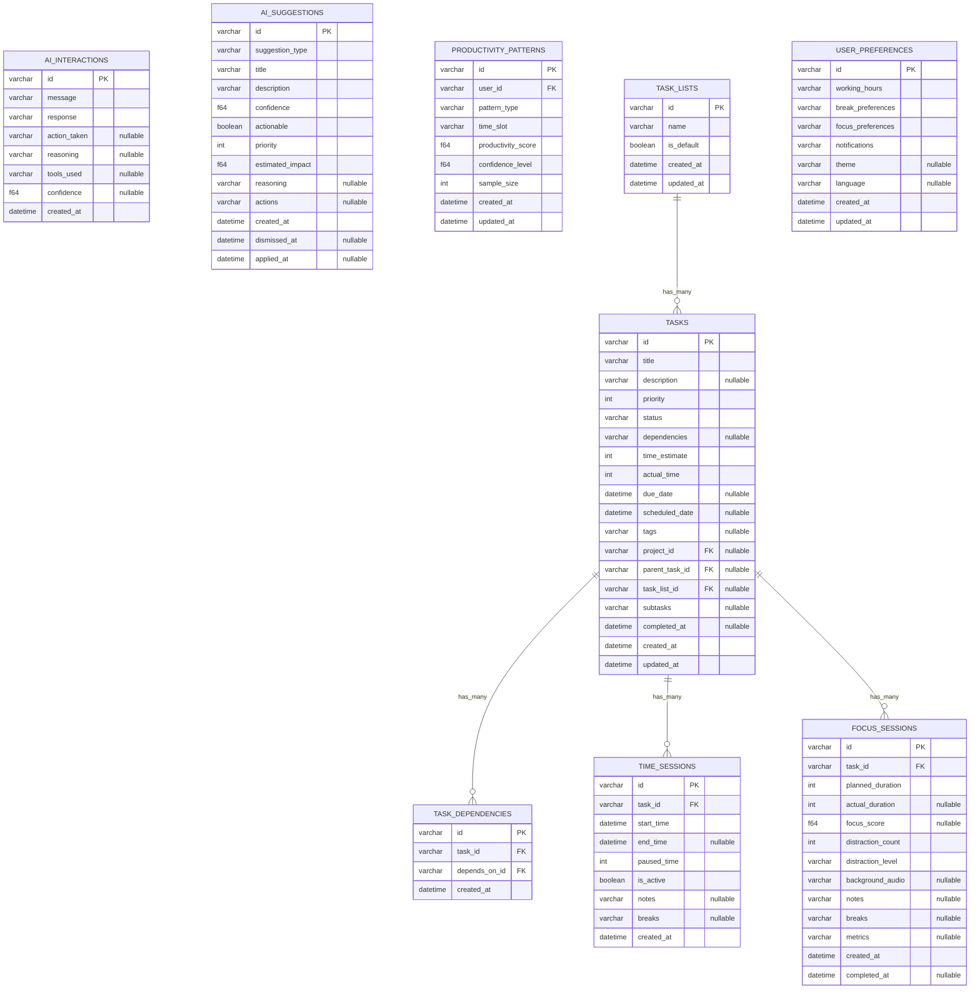

# Database Entity Relationship Diagram

This diagram shows the relationships between all tables in the KiraPilot database.

```mermaid
erDiagram
    AI_INTERACTIONS {
        varchar id PK
        varchar message
        varchar response
        varchar action_taken "nullable"
        varchar reasoning "nullable"
        varchar tools_used "nullable"
        f64 confidence "nullable"
        datetime created_at
    }
    AI_SUGGESTIONS {
        varchar id PK
        varchar suggestion_type
        varchar title
        varchar description
        f64 confidence
        boolean actionable
        int priority
        f64 estimated_impact
        varchar reasoning "nullable"
        varchar actions "nullable"
        datetime created_at
        datetime dismissed_at "nullable"
        datetime applied_at "nullable"
    }
    FOCUS_SESSIONS {
        varchar id PK
        varchar task_id FK
        int planned_duration
        int actual_duration "nullable"
        f64 focus_score "nullable"
        int distraction_count
        varchar distraction_level
        varchar background_audio "nullable"
        varchar notes "nullable"
        varchar breaks "nullable"
        varchar metrics "nullable"
        datetime created_at
        datetime completed_at "nullable"
    }
    PRODUCTIVITY_PATTERNS {
        varchar id PK
        varchar user_id FK
        varchar pattern_type
        varchar time_slot
        f64 productivity_score
        f64 confidence_level
        int sample_size
        datetime created_at
        datetime updated_at
    }
    TASK_DEPENDENCIES {
        varchar id PK
        varchar task_id FK
        varchar depends_on_id FK
        datetime created_at
    }
    TASK_LISTS {
        varchar id PK
        varchar name
        boolean is_default
        datetime created_at
        datetime updated_at
    }
    TASKS {
        varchar id PK
        varchar title
        varchar description "nullable"
        int priority
        varchar status
        varchar dependencies "nullable"
        int time_estimate
        int actual_time
        datetime due_date "nullable"
        datetime scheduled_date "nullable"
        varchar tags "nullable"
        varchar project_id FK "nullable"
        varchar parent_task_id FK "nullable"
        varchar task_list_id FK "nullable"
        varchar subtasks "nullable"
        datetime completed_at "nullable"
        datetime created_at
        datetime updated_at
    }
    TIME_SESSIONS {
        varchar id PK
        varchar task_id FK
        datetime start_time
        datetime end_time "nullable"
        int paused_time
        boolean is_active
        varchar notes "nullable"
        varchar breaks "nullable"
        datetime created_at
    }
    USER_PREFERENCES {
        varchar id PK
        varchar working_hours
        varchar break_preferences
        varchar focus_preferences
        varchar notifications
        varchar theme "nullable"
        varchar language "nullable"
        datetime created_at
        datetime updated_at
    }
    TASK_LISTS ||--o{ TASKS : "has_many"
    TASKS ||--o{ TASK_DEPENDENCIES : "has_many"
    TASKS ||--o{ TIME_SESSIONS : "has_many"
    TASKS ||--o{ FOCUS_SESSIONS : "has_many"
```
