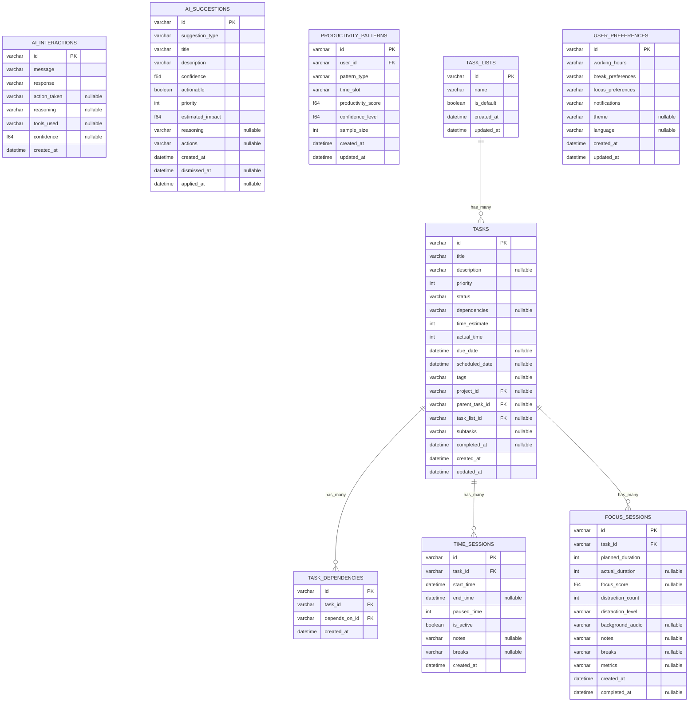

# Database Schema Documentation

This document provides comprehensive documentation for the KiraPilot database schema.

_Generated on: 2025-08-24T14:14:12.213Z_

## Table of Contents

- [Overview](#overview)
- [Tables](#tables)
- [Relationships](#relationships)
- [Migration History](#migration-history)

## Overview

KiraPilot uses SQLite as its database engine with SeaORM as the ORM layer. The database is designed to support:

- Task management with hierarchical relationships
- Time tracking and session management
- AI interaction history
- User preferences and settings
- Productivity analytics and patterns

## Tables

### ai_interactions

| Column       | Type        | Nullable | Key | Description                           |
| ------------ | ----------- | -------- | --- | ------------------------------------- |
| id           | String      | ✗        | PK  | Unique identifier for the record      |
| message      | String      | ✗        |     | message field                         |
| response     | String      | ✗        |     | response field                        |
| action_taken | String      | ✓        |     | action taken field                    |
| reasoning    | String      | ✓        |     | reasoning field                       |
| tools_used   | String      | ✓        |     | tools used field                      |
| confidence   | f64         | ✓        |     | confidence field                      |
| created_at   | DateTimeUtc | ✗        |     | Timestamp when the record was created |

### ai_suggestions

| Column           | Type        | Nullable | Key | Description                           |
| ---------------- | ----------- | -------- | --- | ------------------------------------- |
| id               | String      | ✗        | PK  | Unique identifier for the record      |
| suggestion_type  | String      | ✗        |     | suggestion type field                 |
| title            | String      | ✗        |     | Title or name of the item             |
| description      | String      | ✗        |     | Detailed description                  |
| confidence       | f64         | ✗        |     | confidence field                      |
| actionable       | bool        | ✗        |     | actionable field                      |
| priority         | i32         | ✗        |     | Priority level                        |
| estimated_impact | f64         | ✗        |     | estimated impact field                |
| reasoning        | String      | ✓        |     | reasoning field                       |
| actions          | String      | ✓        |     | actions field                         |
| created_at       | DateTimeUtc | ✗        |     | Timestamp when the record was created |
| dismissed_at     | DateTimeUtc | ✓        |     | dismissed at field                    |
| applied_at       | DateTimeUtc | ✓        |     | applied at field                      |

### focus_sessions

| Column            | Type        | Nullable | Key | Description                           |
| ----------------- | ----------- | -------- | --- | ------------------------------------- |
| id                | String      | ✗        | PK  | Unique identifier for the record      |
| task_id           | String      | ✗        | FK  | Reference to the associated task      |
| planned_duration  | i32         | ✗        |     | planned duration field                |
| actual_duration   | i32         | ✓        |     | actual duration field                 |
| focus_score       | f64         | ✓        |     | focus score field                     |
| distraction_count | i32         | ✗        |     | distraction count field               |
| distraction_level | String      | ✗        |     | distraction level field               |
| background_audio  | String      | ✓        |     | background audio field                |
| notes             | String      | ✓        |     | notes field                           |
| breaks            | String      | ✓        |     | breaks field                          |
| metrics           | String      | ✓        |     | metrics field                         |
| created_at        | DateTimeUtc | ✗        |     | Timestamp when the record was created |
| completed_at      | DateTimeUtc | ✓        |     | completed at field                    |

### productivity_patterns

| Column             | Type        | Nullable | Key | Description                                |
| ------------------ | ----------- | -------- | --- | ------------------------------------------ |
| id                 | String      | ✗        | PK  | Unique identifier for the record           |
| user_id            | String      | ✗        | FK  | Reference to the user                      |
| pattern_type       | String      | ✗        |     | pattern type field                         |
| time_slot          | String      | ✗        |     | time slot field                            |
| productivity_score | f64         | ✗        |     | productivity score field                   |
| confidence_level   | f64         | ✗        |     | confidence level field                     |
| sample_size        | i32         | ✗        |     | sample size field                          |
| created_at         | DateTimeUtc | ✗        |     | Timestamp when the record was created      |
| updated_at         | DateTimeUtc | ✗        |     | Timestamp when the record was last updated |

### task_dependencies

| Column        | Type        | Nullable | Key | Description                           |
| ------------- | ----------- | -------- | --- | ------------------------------------- |
| id            | String      | ✗        | PK  | Unique identifier for the record      |
| task_id       | String      | ✗        | FK  | Reference to the associated task      |
| depends_on_id | String      | ✗        | FK  | depends on id field                   |
| created_at    | DateTimeUtc | ✗        |     | Timestamp when the record was created |

### task_lists

| Column     | Type        | Nullable | Key | Description                                |
| ---------- | ----------- | -------- | --- | ------------------------------------------ |
| id         | String      | ✗        | PK  | Unique identifier for the record           |
| name       | String      | ✗        |     | name field                                 |
| is_default | bool        | ✗        |     | is default field                           |
| created_at | DateTimeUtc | ✗        |     | Timestamp when the record was created      |
| updated_at | DateTimeUtc | ✗        |     | Timestamp when the record was last updated |

**Relationships:**

- has many → tasks

### tasks

| Column         | Type        | Nullable | Key | Description                                |
| -------------- | ----------- | -------- | --- | ------------------------------------------ |
| id             | String      | ✗        | PK  | Unique identifier for the record           |
| title          | String      | ✗        |     | Title or name of the item                  |
| description    | String      | ✓        |     | Detailed description                       |
| priority       | i32         | ✗        |     | Priority level                             |
| status         | String      | ✗        |     | Current status of the item                 |
| dependencies   | String      | ✓        |     | dependencies field                         |
| time_estimate  | i32         | ✗        |     | time estimate field                        |
| actual_time    | i32         | ✗        |     | actual time field                          |
| due_date       | DateTimeUtc | ✓        |     | Due date for completion                    |
| scheduled_date | DateTimeUtc | ✓        |     | Scheduled date for execution               |
| tags           | String      | ✓        |     | tags field                                 |
| project_id     | String      | ✓        | FK  | project id field                           |
| parent_task_id | String      | ✓        | FK  | parent task id field                       |
| task_list_id   | String      | ✓        | FK  | Reference to the task list                 |
| subtasks       | String      | ✓        |     | subtasks field                             |
| completed_at   | DateTimeUtc | ✓        |     | completed at field                         |
| created_at     | DateTimeUtc | ✗        |     | Timestamp when the record was created      |
| updated_at     | DateTimeUtc | ✗        |     | Timestamp when the record was last updated |

**Relationships:**

- has many → task_dependencies
- has many → time_sessions
- has many → focus_sessions

### time_sessions

| Column      | Type        | Nullable | Key | Description                           |
| ----------- | ----------- | -------- | --- | ------------------------------------- |
| id          | String      | ✗        | PK  | Unique identifier for the record      |
| task_id     | String      | ✗        | FK  | Reference to the associated task      |
| start_time  | DateTimeUtc | ✗        |     | Start time of the session             |
| end_time    | DateTimeUtc | ✓        |     | End time of the session               |
| paused_time | i32         | ✗        |     | paused time field                     |
| is_active   | bool        | ✗        |     | is active field                       |
| notes       | String      | ✓        |     | notes field                           |
| breaks      | String      | ✓        |     | breaks field                          |
| created_at  | DateTimeUtc | ✗        |     | Timestamp when the record was created |

### user_preferences

| Column            | Type        | Nullable | Key | Description                                |
| ----------------- | ----------- | -------- | --- | ------------------------------------------ |
| id                | String      | ✗        | PK  | Unique identifier for the record           |
| working_hours     | String      | ✗        |     | working hours field                        |
| break_preferences | String      | ✗        |     | break preferences field                    |
| focus_preferences | String      | ✗        |     | focus preferences field                    |
| notifications     | String      | ✗        |     | notifications field                        |
| theme             | String      | ✓        |     | theme field                                |
| language          | String      | ✓        |     | language field                             |
| created_at        | DateTimeUtc | ✗        |     | Timestamp when the record was created      |
| updated_at        | DateTimeUtc | ✗        |     | Timestamp when the record was last updated |

## Relationships

The following diagram shows the relationships between tables:

## Migration History

| Timestamp       | Description                        | Operations                                                                                                                                                                                                                                   |
| --------------- | ---------------------------------- | -------------------------------------------------------------------------------------------------------------------------------------------------------------------------------------------------------------------------------------------- |
| 20240101_000001 | create tasks table                 | create_table                                                                                                                                                                                                                                 |
| 20240101_000002 | create task dependencies table     | create_table, create_index                                                                                                                                                                                                                   |
| 20240101_000003 | create time sessions table         | create_table                                                                                                                                                                                                                                 |
| 20240101_000004 | create ai interactions table       | create_table                                                                                                                                                                                                                                 |
| 20240101_000005 | create focus sessions table        | create_table                                                                                                                                                                                                                                 |
| 20240101_000006 | create productivity patterns table | create_table                                                                                                                                                                                                                                 |
| 20240101_000007 | create user preferences table      | create_table                                                                                                                                                                                                                                 |
| 20240101_000008 | create ai suggestions table        | create_table                                                                                                                                                                                                                                 |
| 20240101_000009 | create indexes                     | create_index, create_index, create_index, create_index, create_index, create_index, create_index, create_index, create_index, create_index, create_index, create_index, create_index, create_index, create_index, create_index, create_index |
| 20240101_000010 | create task lists table            | create_table, create_index                                                                                                                                                                                                                   |
| 20240101_000011 | add task list id to tasks          | create_index                                                                                                                                                                                                                                 |
| 20240101_000012 | fix task lists unique index        |                                                                                                                                                                                                                                              |

### Migration Details

#### create tasks table (20240101_000001)

**Operations:**

- Create table

#### create task dependencies table (20240101_000002)

**Operations:**

- Create table
- Create index

#### create time sessions table (20240101_000003)

**Operations:**

- Create table

#### create ai interactions table (20240101_000004)

**Operations:**

- Create table

#### create focus sessions table (20240101_000005)

**Operations:**

- Create table

#### create productivity patterns table (20240101_000006)

**Operations:**

- Create table

#### create user preferences table (20240101_000007)

**Operations:**

- Create table

#### create ai suggestions table (20240101_000008)

**Operations:**

- Create table

#### create indexes (20240101_000009)

**Operations:**

- Create index
- Create index
- Create index
- Create index
- Create index
- Create index
- Create index
- Create index
- Create index
- Create index
- Create index
- Create index
- Create index
- Create index
- Create index
- Create index
- Create index

#### create task lists table (20240101_000010)

**Operations:**

- Create table
- Create index

#### add task list id to tasks (20240101_000011)

**Operations:**

- Create index

#### fix task lists unique index (20240101_000012)
