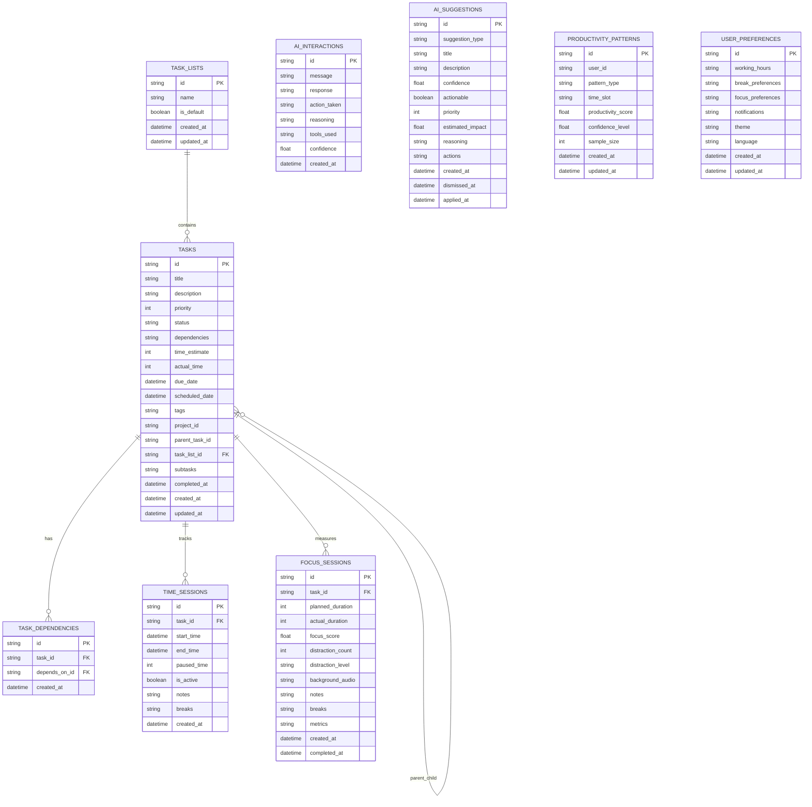

# Database

Understand KiraPilot's database schema and data management.

## Schema Overview

KiraPilot uses SQLite as its primary database with a well-structured schema designed for productivity tracking and AI-assisted task management. The database follows a normalized design with clear relationships between entities.

### Entity Relationship Diagram



## Table Definitions

### Core Tables

#### task_lists

Organizes tasks into logical groups or projects.

| Column     | Type        | Description                           |
| ---------- | ----------- | ------------------------------------- |
| id         | STRING (PK) | Unique identifier (UUID)              |
| name       | STRING      | Display name for the task list        |
| is_default | BOOLEAN     | Whether this is the default task list |
| created_at | DATETIME    | Creation timestamp                    |
| updated_at | DATETIME    | Last modification timestamp           |

#### tasks

Central table storing all task information.

| Column         | Type        | Description                                         |
| -------------- | ----------- | --------------------------------------------------- |
| id             | STRING (PK) | Unique identifier (UUID)                            |
| title          | STRING      | Task title                                          |
| description    | STRING      | Rich text description (optional)                    |
| priority       | INTEGER     | Priority level (1-5)                                |
| status         | STRING      | Current status (todo, in_progress, completed, etc.) |
| dependencies   | STRING      | JSON array of dependency IDs                        |
| time_estimate  | INTEGER     | Estimated time in minutes                           |
| actual_time    | INTEGER     | Actual time spent in minutes                        |
| due_date       | DATETIME    | Due date (optional)                                 |
| scheduled_date | DATETIME    | Scheduled date (optional)                           |
| tags           | STRING      | JSON array of tags                                  |
| project_id     | STRING      | Associated project ID (optional)                    |
| parent_task_id | STRING      | Parent task for subtasks (optional)                 |
| task_list_id   | STRING (FK) | Associated task list                                |
| subtasks       | STRING      | JSON array of subtask IDs                           |
| completed_at   | DATETIME    | Completion timestamp (optional)                     |
| created_at     | DATETIME    | Creation timestamp                                  |
| updated_at     | DATETIME    | Last modification timestamp                         |

#### task_dependencies

Explicit task dependency relationships.

| Column        | Type        | Description                       |
| ------------- | ----------- | --------------------------------- |
| id            | STRING (PK) | Unique identifier (UUID)          |
| task_id       | STRING (FK) | Task that has the dependency      |
| depends_on_id | STRING (FK) | Task that must be completed first |
| created_at    | DATETIME    | Creation timestamp                |

### Time Tracking Tables

#### time_sessions

Records time tracking sessions for tasks.

| Column      | Type        | Description                                     |
| ----------- | ----------- | ----------------------------------------------- |
| id          | STRING (PK) | Unique identifier (UUID)                        |
| task_id     | STRING (FK) | Associated task                                 |
| start_time  | DATETIME    | Session start time                              |
| end_time    | DATETIME    | Session end time (optional for active sessions) |
| paused_time | INTEGER     | Total paused time in seconds                    |
| is_active   | BOOLEAN     | Whether session is currently active             |
| notes       | STRING      | Session notes (optional)                        |
| breaks      | STRING      | JSON array of break periods                     |
| created_at  | DATETIME    | Creation timestamp                              |

#### focus_sessions

Detailed focus session tracking with productivity metrics.

| Column            | Type        | Description                         |
| ----------------- | ----------- | ----------------------------------- |
| id                | STRING (PK) | Unique identifier (UUID)            |
| task_id           | STRING (FK) | Associated task                     |
| planned_duration  | INTEGER     | Planned session duration in minutes |
| actual_duration   | INTEGER     | Actual session duration in minutes  |
| focus_score       | FLOAT       | Calculated focus score (0.0-1.0)    |
| distraction_count | INTEGER     | Number of distractions              |
| distraction_level | STRING      | Overall distraction level           |
| background_audio  | STRING      | Background audio settings           |
| notes             | STRING      | Session notes                       |
| breaks            | STRING      | JSON array of break periods         |
| metrics           | STRING      | JSON object with detailed metrics   |
| created_at        | DATETIME    | Creation timestamp                  |
| completed_at      | DATETIME    | Completion timestamp                |

### AI and Analytics Tables

#### ai_interactions

Stores AI assistant conversation history.

| Column       | Type        | Description                       |
| ------------ | ----------- | --------------------------------- |
| id           | STRING (PK) | Unique identifier (UUID)          |
| message      | STRING      | User message                      |
| response     | STRING      | AI response                       |
| action_taken | STRING      | Action performed by AI (optional) |
| reasoning    | STRING      | AI reasoning process (optional)   |
| tools_used   | STRING      | JSON array of tools used          |
| confidence   | FLOAT       | AI confidence score (0.0-1.0)     |
| created_at   | DATETIME    | Creation timestamp                |

#### ai_suggestions

AI-generated productivity suggestions.

| Column           | Type        | Description                      |
| ---------------- | ----------- | -------------------------------- |
| id               | STRING (PK) | Unique identifier (UUID)         |
| suggestion_type  | STRING      | Type of suggestion               |
| title            | STRING      | Suggestion title                 |
| description      | STRING      | Detailed description             |
| confidence       | FLOAT       | AI confidence in suggestion      |
| actionable       | BOOLEAN     | Whether suggestion is actionable |
| priority         | INTEGER     | Suggestion priority (1-5)        |
| estimated_impact | FLOAT       | Estimated productivity impact    |
| reasoning        | STRING      | AI reasoning for suggestion      |
| actions          | STRING      | JSON array of suggested actions  |
| created_at       | DATETIME    | Creation timestamp               |
| dismissed_at     | DATETIME    | Dismissal timestamp (optional)   |
| applied_at       | DATETIME    | Application timestamp (optional) |

#### productivity_patterns

Learned productivity patterns for optimization.

| Column             | Type        | Description                        |
| ------------------ | ----------- | ---------------------------------- |
| id                 | STRING (PK) | Unique identifier (UUID)           |
| user_id            | STRING      | User identifier                    |
| pattern_type       | STRING      | Type of pattern (time, task, etc.) |
| time_slot          | STRING      | Time period for pattern            |
| productivity_score | FLOAT       | Productivity score for pattern     |
| confidence_level   | FLOAT       | Statistical confidence             |
| sample_size        | INTEGER     | Number of data points              |
| created_at         | DATETIME    | Creation timestamp                 |
| updated_at         | DATETIME    | Last update timestamp              |

### Configuration Tables

#### user_preferences

User settings and preferences.

| Column            | Type        | Description                            |
| ----------------- | ----------- | -------------------------------------- |
| id                | STRING (PK) | Unique identifier (always "default")   |
| working_hours     | STRING      | JSON object with working hours         |
| break_preferences | STRING      | JSON object with break settings        |
| focus_preferences | STRING      | JSON object with focus settings        |
| notifications     | STRING      | JSON object with notification settings |
| theme             | STRING      | UI theme preference                    |
| language          | STRING      | Language preference                    |
| created_at        | DATETIME    | Creation timestamp                     |
| updated_at        | DATETIME    | Last modification timestamp            |

## Migrations

KiraPilot uses SeaORM's migration system for database schema management. Migrations are versioned and applied automatically when the application starts.

### Migration System Architecture

```rust
// Migration trait implementation
pub struct Migrator;

#[async_trait::async_trait]
impl MigratorTrait for Migrator {
    fn migrations() -> Vec<Box<dyn MigrationTrait>> {
        vec![
            Box::new(m20240101_000001_create_tasks_table::Migration),
            Box::new(m20240101_000002_create_task_dependencies_table::Migration),
            // ... more migrations
        ]
    }
}
```

### Migration Naming Convention

Migrations follow the pattern: `m{YYYYMMDD}_{HHMMSS}_{description}.rs`

- **Date**: Migration creation date
- **Time**: Migration creation time (for ordering)
- **Description**: Brief description of changes

### Current Migrations

1. **m20240101_000001_create_tasks_table**: Initial tasks table
2. **m20240101_000002_create_task_dependencies_table**: Task dependencies
3. **m20240101_000003_create_time_sessions_table**: Time tracking
4. **m20240101_000004_create_ai_interactions_table**: AI conversation history
5. **m20240101_000005_create_focus_sessions_table**: Focus session tracking
6. **m20240101_000006_create_productivity_patterns_table**: Pattern recognition
7. **m20240101_000007_create_user_preferences_table**: User settings
8. **m20240101_000008_create_ai_suggestions_table**: AI suggestions
9. **m20240101_000009_create_indexes**: Performance indexes
10. **m20240101_000010_create_task_lists_table**: Task organization
11. **m20240101_000011_add_task_list_id_to_tasks**: Task list relationships
12. **m20240101_000012_fix_task_lists_unique_index**: Index optimization

### Running Migrations

Migrations run automatically when the application starts:

```rust
// Automatic migration on startup
pub async fn run_migrations(db: &DatabaseConnection) -> Result<(), DbErr> {
    let pending_migrations = Migrator::get_pending_migrations(db).await?;

    if !pending_migrations.is_empty() {
        Migrator::up(db, None).await?;
    }

    Ok(())
}
```

### Migration Development

#### Creating a New Migration

1. **Generate migration file**:

   ```bash
   # In src-tauri directory
   sea-orm-cli migrate generate create_new_table
   ```

2. **Implement migration**:

   ```rust
   use sea_orm_migration::prelude::*;

   #[derive(DeriveMigrationName)]
   pub struct Migration;

   #[async_trait::async_trait]
   impl MigrationTrait for Migration {
       async fn up(&self, manager: &SchemaManager) -> Result<(), DbErr> {
           manager
               .create_table(
                   Table::create()
                       .table(NewTable::Table)
                       .if_not_exists()
                       .col(
                           ColumnDef::new(NewTable::Id)
                               .string()
                               .not_null()
                               .primary_key(),
                       )
                       .to_owned(),
               )
               .await
       }

       async fn down(&self, manager: &SchemaManager) -> Result<(), DbErr> {
           manager
               .drop_table(Table::drop().table(NewTable::Table).to_owned())
               .await
       }
   }
   ```

3. **Add to migrator**:
   ```rust
   // In mod.rs
   Box::new(m20240101_000013_create_new_table::Migration),
   ```

#### Testing Migrations

```rust
// Test migration compatibility
pub async fn test_migration_compatibility(
    db: &DatabaseConnection,
) -> Result<MigrationTestResult, DbErr> {
    // Apply all migrations
    Migrator::up(db, None).await?;

    // Test rollback
    rollback_last_migration(db).await?;

    // Re-apply
    Migrator::up(db, None).await?;

    Ok(test_result)
}
```

## Repository Pattern

KiraPilot implements the Repository pattern for clean separation between business logic and data access.

### Repository Architecture

```rust
// Generic repository trait
#[async_trait]
pub trait Repository<T, ID> {
    async fn create(&self, entity: T) -> Result<T, DbErr>;
    async fn find_by_id(&self, id: ID) -> Result<Option<T>, DbErr>;
    async fn update(&self, id: ID, entity: T) -> Result<T, DbErr>;
    async fn delete(&self, id: ID) -> Result<(), DbErr>;
    async fn find_all(&self) -> Result<Vec<T>, DbErr>;
}
```

### Task Repository Implementation

```rust
pub struct TaskRepository {
    db: DatabaseConnection,
}

impl TaskRepository {
    pub fn new(db: DatabaseConnection) -> Self {
        Self { db }
    }

    pub async fn create_task(&self, task_data: CreateTaskInput) -> Result<Task, DbErr> {
        let task = tasks::ActiveModel {
            id: Set(Uuid::new_v4().to_string()),
            title: Set(task_data.title),
            description: Set(task_data.description),
            priority: Set(task_data.priority),
            status: Set("todo".to_string()),
            created_at: Set(Utc::now()),
            updated_at: Set(Utc::now()),
            ..Default::default()
        };

        let result = task.insert(&self.db).await?;
        Ok(result)
    }

    pub async fn find_by_status(&self, status: &str) -> Result<Vec<Task>, DbErr> {
        tasks::Entity::find()
            .filter(tasks::Column::Status.eq(status))
            .all(&self.db)
            .await
    }

    pub async fn find_with_time_sessions(&self, task_id: &str) -> Result<Option<(Task, Vec<TimeSession>)>, DbErr> {
        tasks::Entity::find_by_id(task_id)
            .find_with_related(time_sessions::Entity)
            .all(&self.db)
            .await
            .map(|results| results.into_iter().next())
    }
}
```

### Service Layer Integration

```rust
pub struct TaskService {
    task_repo: TaskRepository,
    time_repo: TimeTrackingRepository,
}

impl TaskService {
    pub async fn create_task_with_estimate(&self, task_data: CreateTaskInput) -> Result<Task, ServiceError> {
        // Business logic validation
        if task_data.time_estimate < 0 {
            return Err(ServiceError::InvalidInput("Time estimate cannot be negative".to_string()));
        }

        // Create task through repository
        let task = self.task_repo.create_task(task_data).await?;

        // Additional business logic
        if task.priority >= 4 {
            self.notify_high_priority_task(&task).await?;
        }

        Ok(task)
    }
}
```

### Database Connection Management

```rust
// Connection pool management
pub struct DatabaseManager {
    connection: Arc<DatabaseConnection>,
}

impl DatabaseManager {
    pub async fn new(database_url: &str) -> Result<Self, DbErr> {
        let connection = Database::connect(database_url).await?;

        // Run migrations
        run_migrations(&connection).await?;

        Ok(Self {
            connection: Arc::new(connection),
        })
    }

    pub fn get_connection(&self) -> &DatabaseConnection {
        &self.connection
    }
}
```

## Query Optimization

### Indexes

The database includes strategic indexes for performance:

```sql
-- Task queries
CREATE INDEX idx_tasks_status ON tasks(status);
CREATE INDEX idx_tasks_due_date ON tasks(due_date);
CREATE INDEX idx_tasks_task_list_id ON tasks(task_list_id);
CREATE INDEX idx_tasks_created_at ON tasks(created_at);

-- Time tracking queries
CREATE INDEX idx_time_sessions_task_id ON time_sessions(task_id);
CREATE INDEX idx_time_sessions_start_time ON time_sessions(start_time);
CREATE INDEX idx_time_sessions_is_active ON time_sessions(is_active);

-- AI queries
CREATE INDEX idx_ai_interactions_created_at ON ai_interactions(created_at);
CREATE INDEX idx_ai_suggestions_suggestion_type ON ai_suggestions(suggestion_type);
```

### Query Patterns

#### Efficient Task Loading

```rust
// Load tasks with related data in single query
pub async fn find_tasks_with_sessions(&self, limit: u64) -> Result<Vec<(Task, Vec<TimeSession>)>, DbErr> {
    tasks::Entity::find()
        .find_with_related(time_sessions::Entity)
        .limit(limit)
        .all(&self.db)
        .await
}
```

#### Pagination

```rust
pub async fn find_tasks_paginated(&self, page: u64, per_page: u64) -> Result<Vec<Task>, DbErr> {
    tasks::Entity::find()
        .order_by_desc(tasks::Column::CreatedAt)
        .paginate(&self.db, per_page)
        .fetch_page(page)
        .await
}
```

## Data Integrity

### Constraints

- **Primary Keys**: All tables use UUID primary keys
- **Foreign Keys**: Enforced relationships between tables
- **Not Null**: Required fields marked as NOT NULL
- **Unique Constraints**: Prevent duplicate data where appropriate

### Validation

```rust
// Entity-level validation
impl ActiveModelBehavior for tasks::ActiveModel {
    fn before_save<C>(self, _db: &C, insert: bool) -> Result<Self, DbErr>
    where
        C: ConnectionTrait,
    {
        // Validate priority range
        if let Set(priority) = &self.priority {
            if *priority < 1 || *priority > 5 {
                return Err(DbErr::Custom("Priority must be between 1 and 5".to_string()));
            }
        }

        // Set updated_at for updates
        if !insert {
            Ok(Self {
                updated_at: Set(Utc::now()),
                ..self
            })
        } else {
            Ok(self)
        }
    }
}
```

## Backup and Recovery

### Backup Strategy

```rust
pub async fn backup_database(db_path: &str, backup_path: &str) -> Result<(), std::io::Error> {
    // SQLite backup using file copy
    std::fs::copy(db_path, backup_path)?;
    Ok(())
}

pub async fn restore_database(backup_path: &str, db_path: &str) -> Result<(), std::io::Error> {
    // Restore from backup
    std::fs::copy(backup_path, db_path)?;
    Ok(())
}
```

### Data Export

```rust
pub async fn export_tasks_to_json(&self) -> Result<String, DbErr> {
    let tasks = tasks::Entity::find().all(&self.db).await?;
    let json = serde_json::to_string_pretty(&tasks)?;
    Ok(json)
}
```

This database design provides a solid foundation for KiraPilot's productivity features while maintaining data integrity, performance, and extensibility for future enhancements.
